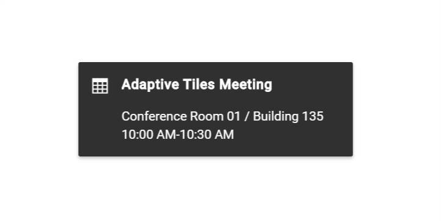

# Getting Started with Blazor Toast Web App

This article provides a step-by-step instructions for building `Blazor Web App` with [Blazor Toast](https://www.syncfusion.com/blazor-components/blazor-toast) component using [Visual Studio](https://visualstudio.microsoft.com/vs/).

## Prerequisites

* [System requirements for Blazor components](https://blazor.syncfusion.com/documentation/system-requirements)

## Create a new Blazor Web App

You can create a **Blazor Web App** using Visual Studio 2022 via [Microsoft Templates](https://learn.microsoft.com/en-us/aspnet/core/blazor/tooling?view=aspnetcore-8.0) or the [Syncfusion Blazor Extension](https://blazor.syncfusion.com/documentation/visual-studio-integration/template-studio). While creating a Blazor Web App, configure corresponding [Interactive render mode](https://learn.microsoft.com/en-us/aspnet/core/blazor/components/render-modes?view=aspnetcore-8.0#render-modes) and [Interactivity location](https://learn.microsoft.com/en-us/aspnet/core/blazor/tooling?view=aspnetcore-8.0&pivots=windows).

## Install Syncfusion Blazor Notifications and Themes NuGet in the App

To add **Blazor Toast** component in the app, open the NuGet package manager in Visual Studio (*Tools → NuGet Package Manager → Manage NuGet Packages for Solution*), search and install [Syncfusion.Blazor.Notifications](https://www.nuget.org/packages/Syncfusion.Blazor.Notifications) and [Syncfusion.Blazor.Themes](https://www.nuget.org/packages/Syncfusion.Blazor.Themes/). For a web app with `WebAssembly` or `Auto` interactive render mode, install the Syncfusion NuGet packages in the project where you intend to add the components.  Alternatively, you can utilize the following package manager command to achieve the same.




Install-Package Syncfusion.Blazor.Notifications -Version {{ site.releaseversion }}
Install-Package Syncfusion.Blazor.Themes -Version {{ site.releaseversion }}




N> Syncfusion Blazor components are available in [nuget.org](https://www.nuget.org/packages?q=syncfusion.blazor). Refer to [NuGet packages](https://blazor.syncfusion.com/documentation/nuget-packages) topic for available NuGet packages list with component details.

## Register Syncfusion Blazor Service

Open **~/_Imports.razor** file and import the `Syncfusion.Blazor` and `Syncfusion.Blazor.Notifications` namespace .

```cshtml

@using Syncfusion.Blazor
@using Syncfusion.Blazor.Notifications
```

Now, register the Syncfusion Blazor Service in the **~/Program.cs** file of your Blazor Web App. For a app with `WebAssembly` or `Auto (Server and WebAssembly)` interactive render mode, register the Syncfusion Blazor service in both **~/Program.cs** files of your web app.

```cshtml

....
using Syncfusion.Blazor;
....
builder.Services.AddSyncfusionBlazor();
....

```

## Add stylesheet and script resources

The theme stylesheet and script can be accessed from NuGet through [Static Web Assets](https://blazor.syncfusion.com/documentation/appearance/themes#static-web-assets). Include the stylesheet reference in the `<head>` section and the script reference at the end of the `<body>` in the **~/Components/App.razor** file as shown below:

```html
<head>
    ....
    <link href="_content/Syncfusion.Blazor.Themes/material.css" rel="stylesheet" />
</head>

<body>
    ....
    <script src="_content/Syncfusion.Blazor.Core/scripts/syncfusion-blazor.min.js" type="text/javascript"></script>
</body>
```

N> Check out the [Blazor Themes](https://blazor.syncfusion.com/documentation/appearance/themes) topic to discover various methods ([Static Web Assets](https://blazor.syncfusion.com/documentation/appearance/themes#static-web-assets), [CDN](https://blazor.syncfusion.com/documentation/appearance/themes#cdn-reference), and [CRG](https://blazor.syncfusion.com/documentation/common/custom-resource-generator)) for referencing themes in your Blazor application. Also, check out the [Adding Script Reference](https://blazor.syncfusion.com/documentation/common/adding-script-references) topic to learn different approaches for adding script references in your Blazor application.

## Add Syncfusion Blazor Toast component

Add the Syncfusion Blazor Toast component in the **~/Components/Pages/*.razor** file. If an interactivity location as `Per page/component` in the web app, define a render mode at the top of the `~Pages/*.razor` component, as follows:




@* desired render mode define here *@
@rendermode InteractiveServer







<div class="col-lg-12 control-section toast-default-section">
    <SfToast ID="toast_default" @ref="ToastObj" Title="Adaptive Tiles Meeting" Content="@ToastContent" Timeout="5000" Icon="e-meeting">
        <ToastPosition X="@ToastPosition"></ToastPosition>
    </SfToast>
    <div class="col-lg-12 col-sm-12 col-md-12 center">
        <div id="toastBtnDefault" style="margin: auto;text-align: center">
            <button class="e-btn" @onclick="@ShowOnClick">Show Toasts</button>
            <button class="e-btn" @onclick="@HideOnClick">Hide All</button>
        </div>
    </div>
</div>
<style>
    #toast_default .e-meeting::before {
        content: "\e705";
        font-size: 17px;
    }

    .bootstrap4 #toast_default .e-meeting::before {
        content: "\e763";
        font-size: 20px;
    }
</style>
@code {
    SfToast ToastObj;
    private string ToastPosition = "Right";
    private string ToastContent = "Conference Room 01 / Building 135 10:00 AM-10:30 AM";
    private async Task ShowOnClick()
    {
        await this.ToastObj.ShowAsync();
    }
    private async Task HideOnClick()
    {
        await this.ToastObj.HideAsync("All");
    }
}




* Press <kbd>Ctrl</kbd>+<kbd>F5</kbd> (Windows) or <kbd>⌘</kbd>+<kbd>F5</kbd> (macOS) to launch the application. This will render the Syncfusion Blazor Toast component in your default web browser.

