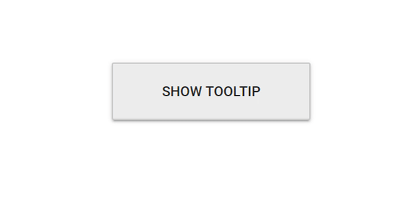

# Tooltip Positioning

Tooltips can be attached to 12 static locations around the target.
On initializing the Tooltip, you can set the position property with any one of the following values:

* `TopLeft`
* `TopCenter`
* `TopRight`
* `BottomLeft`
* `BottomCenter`
* `BottomRight`
* `LeftTop`
* `LeftCenter`
* `LeftBottom`
* `RightTop`
* `RightCenter`
* `RightBottom`

> By default, Tooltip is placed at the `TopCenter` of the target element.

```csharp
@using Syncfusion.Blazor.Popups
@using Syncfusion.Blazor.Buttons

<SfTooltip Target="#target" Content="@Content" Position="Position.RightCenter">
    <SfButton ID="target" Content="Show Tooltip"></SfButton>
</SfTooltip>

@code
{
    string Content = "Tooltip Content";
}
```

Output be like the below.


## Mouse trailing

Tooltips can be positioned relative to the mouse pointer. This behavior can be enabled or disabled by using the `MouseTrail` property. By default, it is set to `false`.

```csharp
@using Syncfusion.Blazor.Popups
@using Syncfusion.Blazor.Buttons

<SfTooltip MouseTrail=true Content="@Content" Target="#target">
    <SfButton ID="target" Content="Show Tooltip"></SfButton>
</SfTooltip>

@code
{
    string Content="Tooltip Content";
}

<style>
    #target {
        background-color: #ececec;
        border: 1px solid #c8c8c8;
        box-sizing: border-box;
        margin: 80px auto;
        padding: 20px;
        width: 200px;
    }
</style>
```

Output be like the below.



> When mouse trailing option is enabled, the tip pointer position gets auto adjusted based on the target, and other position values like start, end, and middle are not applied (to prevent the pointer from moving out of target).

## Setting offset values

Offset values are set to specify the distance between the target and tooltip element.
`OffsetX` and `OffsetY` properties are used to specify the offset left and top values.

* `OffsetX` specifies the distance between the target and Tooltip element in X axis.
* `OffsetY` specifies the distance between the target and Tooltip element in Y axis.

The following code example illustrates how to set offset values.

```csharp
@using Syncfusion.Blazor.Popups
@using Syncfusion.Blazor.Buttons

<SfTooltip Target="#target" ShowTipPointer="false" MouseTrail="true" Content="@Content" OffsetX="30" OffsetY="30">
    <SfButton ID="target" Content="Show Tooltip"></SfButton>
</SfTooltip>

@code
{
    string Content="Tooltip Content";
}

<style>
    #target {
        background-color: #ececec;
        border: 1px solid #c8c8c8;
        box-sizing: border-box;
        margin: 80px auto;
        padding: 20px;
        width: 200px;
    }
</style>

```

Output be like the below.


> By default, collision is handled automatically and therefore when collision is detected the Tooltip fits horizontally and flips vertically.
