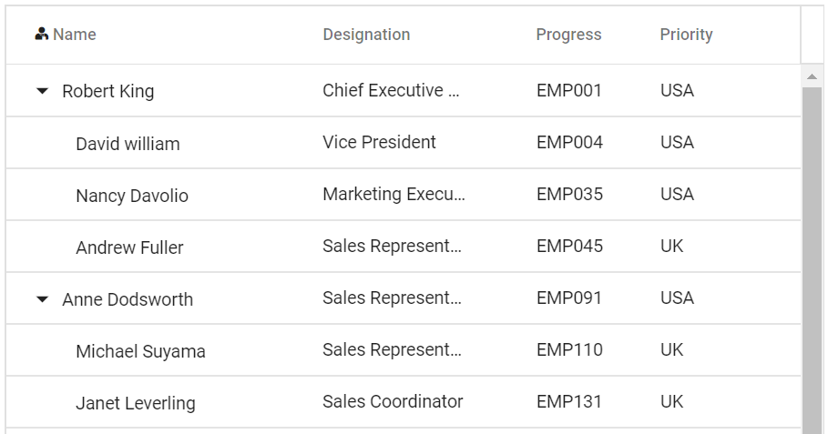
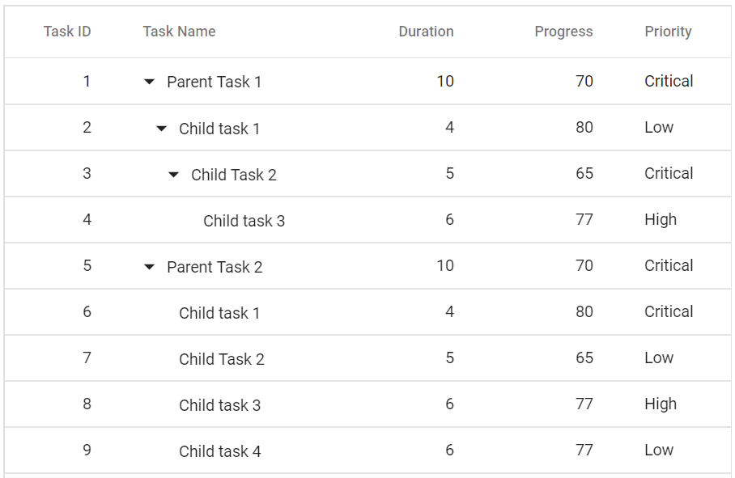
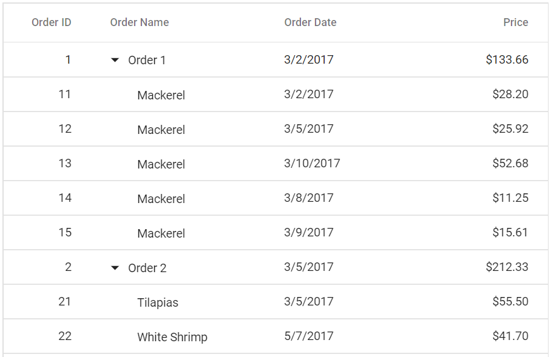
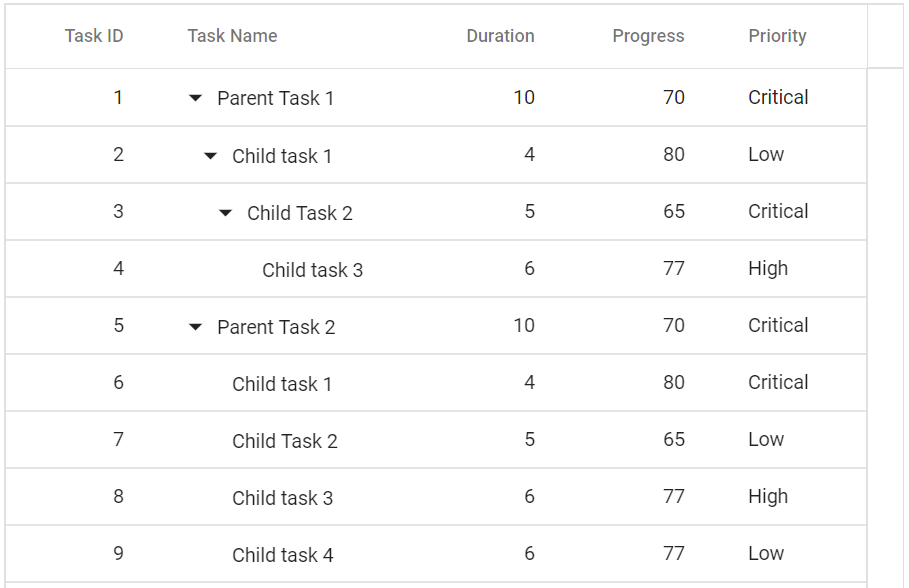
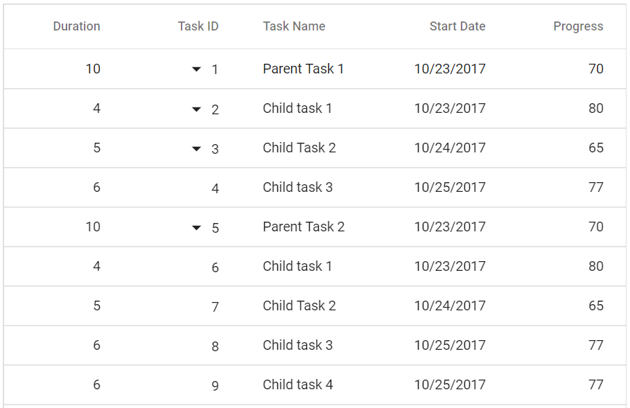
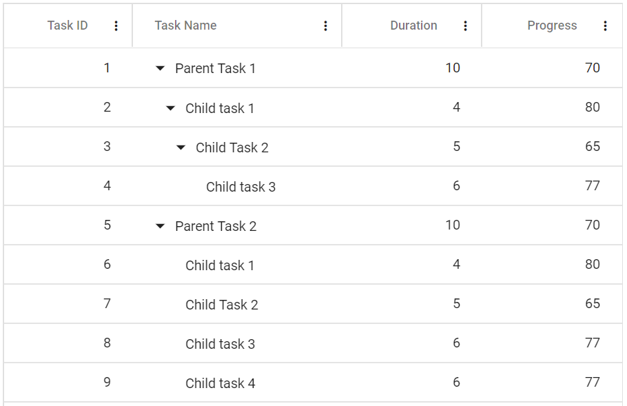
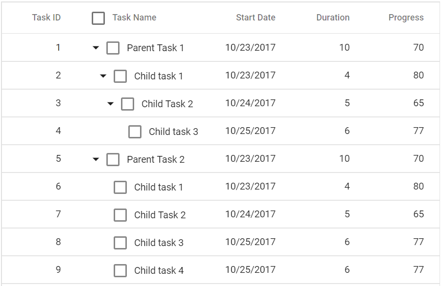
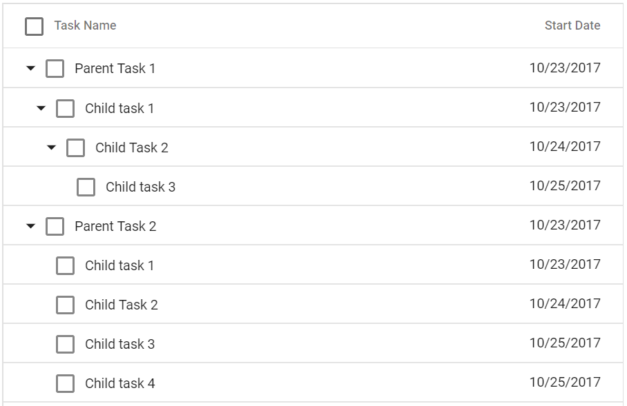
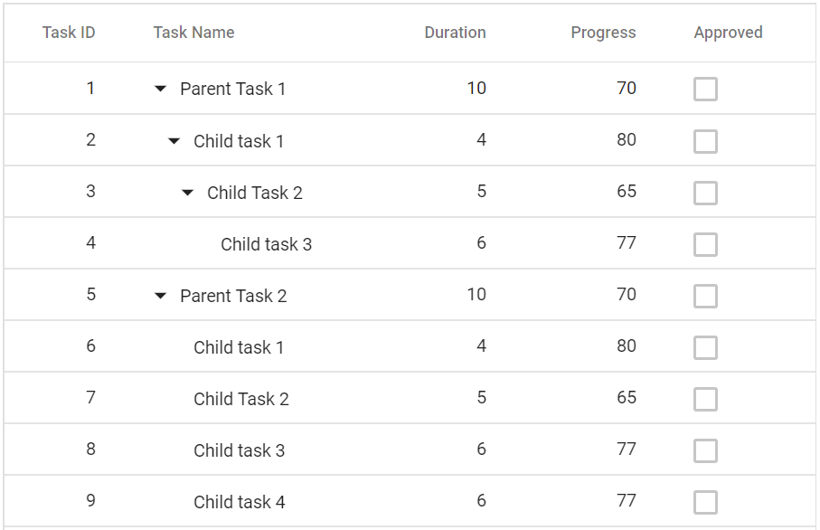

# Columns

The column definitions are used as the datasource schema in the Tree Grid. This plays a vital role in rendering column values in the required format.
The tree grid operations such as sorting, filtering and searching etc. are performed based on column definitions. The [`Field`](https://help.syncfusion.com/cr/blazor/Syncfusion.Blazor~Syncfusion.Blazor.TreeGrid.TreeGridColumn~Field.html) property of [`TreeGridColumns`](https://help.syncfusion.com/cr/blazor/Syncfusion.Blazor~Syncfusion.Blazor.TreeGrid.TreeGridColumns.html) tag helper
is necessary to map the data source values in Tree Grid columns.

> 1. If the column [`Field`](https://help.syncfusion.com/cr/blazor/Syncfusion.Blazor~Syncfusion.Blazor.TreeGrid.TreeGridColumn~Field.html) is not specified in the dataSource, the column values will be empty.

[`TreeColumnIndex`](https://help.syncfusion.com/cr/blazor/Syncfusion.Blazor~Syncfusion.Blazor.TreeGrid.SfTreeGrid~TreeColumnIndex.html) property denotes the column that is used to expand and collapse child rows.

## Complex data binding

You can achieve the complex data binding in the Tree Grid by using the dot(.) operator in the column.field. In the below examples **Task.TaskName** and **Task.Duration** are complex data.

```csharp
@using Syncfusion.Blazor.TreeGrid

<SfTreeGrid DataSource="@TreeData" AllowPaging="true" IdMapping="TaskId" ParentIdMapping="ParentId" TreeColumnIndex="1">
    <TreeGridColumns>
        <TreeGridColumn Field="TaskId" HeaderText="Task ID" Width="80" TextAlign="Syncfusion.Blazor.Grids.TextAlign.Right"></TreeGridColumn>
        <TreeGridColumn Field="Task.TaskName" HeaderText="Task Name" Width="160"></TreeGridColumn>
        <TreeGridColumn Field="Task.Duration" HeaderText="Duration" Width="100" TextAlign="Syncfusion.Blazor.Grids.TextAlign.Right"></TreeGridColumn>
        <TreeGridColumn Field="Progress" HeaderText="Progress" Width="100" TextAlign="Syncfusion.Blazor.Grids.TextAlign.Right"></TreeGridColumn>
        <TreeGridColumn Field="Priority" HeaderText="Priority" Width="80"></TreeGridColumn>
    </TreeGridColumns>
</SfTreeGrid>

@code{
    public class BusinessObject
    {
        public int TaskId { get; set; }
        public TaskDetails Task { get; set; }
        public int Progress { get; set; }
        public string Priority { get; set; }
        public int? ParentId { get; set; }
    }

    public class TaskDetails
    {
        public string TaskName { get; set; }
        public int Duration { get; set; }
    }
    public List<BusinessObject> TreeData = new List<BusinessObject>();
    protected override void OnInitialized()
    {
        TreeData.Add(new BusinessObject() { Task = new TaskDetails() { TaskName = "Parent Task 1", Duration = 50000 }, TaskId = 1, Progress = 70, ParentId = null, Priority = "High" });
        TreeData.Add(new BusinessObject() { Task = new TaskDetails() { TaskName = "Child task 1", Duration = 400000 }, TaskId = 2, Progress = 80, ParentId = 1, Priority = "Normal" });
        TreeData.Add(new BusinessObject() { Task = new TaskDetails() { TaskName = "Child Task 2", Duration = 500000 }, TaskId = 3, Progress = 65, ParentId = 1, Priority = "Critical" });
        TreeData.Add(new BusinessObject() { Task = new TaskDetails() { TaskName = "Parent Task 2", Duration = 50000 }, TaskId = 4, Progress = 70, ParentId = null, Priority = "High" });
        TreeData.Add(new BusinessObject() { Task = new TaskDetails() { TaskName = "Child task 1", Duration = 400000 }, TaskId = 5, Progress = 80, ParentId = 4, Priority = "Normal" });
        TreeData.Add(new BusinessObject() { Task = new TaskDetails() { TaskName = "Child Task 2", Duration = 500000 }, TaskId = 6, Progress = 65, ParentId = 4, Priority = "Critical" });

    }
}
```

The following image represents complex data binding


### Expando data binding

Tree Grid supports Complex Data Binding with ExpandoObject. In the below examples **Task.TaskName** and **Task.Duration** are complex data with ExpandoObject

```csharp
@using Syncfusion.Blazor.TreeGrid;
@using System.Dynamic;

<SfTreeGrid DataSource="@TreeData" AllowPaging="true" IdMapping="TaskID" ParentIdMapping="ParentID" TreeColumnIndex="1">
    <TreeGridColumns>
        <TreeGridColumn Field="TaskID" HeaderText="Task ID" Width="80" TextAlign="Syncfusion.Blazor.Grids.TextAlign.Right"></TreeGridColumn>
        <TreeGridColumn Field="Task.TaskName" HeaderText="Task Name" Width="160"></TreeGridColumn>
        <TreeGridColumn Field="Task.Duration" HeaderText="Duration" Width="160" TextAlign="Syncfusion.Blazor.Grids.TextAlign.Right"></TreeGridColumn>
        <TreeGridColumn Field="Progress" HeaderText="Progress" Width="100" TextAlign="Syncfusion.Blazor.Grids.TextAlign.Right"></TreeGridColumn>
        <TreeGridColumn Field="Priority" HeaderText="Priority" Width="80"></TreeGridColumn>
    </TreeGridColumns>
</SfTreeGrid>
@code {
    public List<ExpandoObject> TreeData { get; set; }
    protected override void OnInitialized()
    {
        this.TreeData = GetData().ToList();
    }
    public static List<ExpandoObject> Data = new List<ExpandoObject>();
    public static int ParentRecordID { get; set; }
    public static int ChildRecordID { get; set; }
    public static List<ExpandoObject> GetData()
    {
        Data.Clear();
        ParentRecordID = 0;
        ChildRecordID = 0;
        for (var i = 1; i <= 2; i++)
        {

            dynamic ParentRecord = new ExpandoObject();
            dynamic Task = new ExpandoObject();
            Task.TaskName = "Parent Task " + i;
            Task.Duration = ParentRecordID % 2 == 0 ? 32 : 76;
            ParentRecord.TaskID = ++ParentRecordID;
            ParentRecord.Task = Task;
            ParentRecord.Progress = ParentRecordID % 2 == 0 ? "In Progress" : "Open";
            ParentRecord.Priority = ParentRecordID % 2 == 0 ? "High" : "Low";
            ParentRecord.ParentID = null;
            Data.Add(ParentRecord);
            AddChildRecords(ParentRecordID);
        }
        return Data;
    }
    public static void AddChildRecords(int ParentId)
    {
        for (var i = 1; i < 3; i++)
        {

            dynamic ChildRecord = new ExpandoObject();
            dynamic Task = new ExpandoObject();
            Task.TaskName = "Child Task " + ++ChildRecordID;
            Task.Duration = ParentRecordID % 3 == 0 ? 64 : 98;
            ChildRecord.TaskID = ++ParentRecordID;
            ChildRecord.Task = Task;
            ChildRecord.Progress = ParentRecordID % 3 == 0 ? "Validated" : "Closed";
            ChildRecord.Priority = ParentRecordID % 3 == 0 ? "Low" : "Critical";
            ChildRecord.ParentID = ParentId;
            Data.Add(ChildRecord);
        }
    }
}
```

The following image represents complex data binding with expandoObject


## Header template

You can customize the header element by using the [`HeaderTemplate`](https://help.syncfusion.com/cr/blazor/Syncfusion.Blazor~Syncfusion.Blazor.TreeGrid.TreeGridColumn~HeaderTemplate.html) property.



@using TreeGridComponent.Data;
@using Syncfusion.Blazor.TreeGrid;

<SfTreeGrid  Height="400" DataSource="@TreeGridData" IdMapping="EmployeeID" ParentIdMapping="ParentId" TreeColumnIndex="0">
    <TreeGridColumns>
        <TreeGridColumn Field="Name" HeaderText="Name" Width="160">
            <HeaderTemplate>
                    <div>
                        <span class="e-icon-userlogin e-icons employee"></span> Name
                    </div>
            </HeaderTemplate>
        </TreeGridColumn>
        <TreeGridColumn Field="Designation" HeaderText="Designation" Width="120"></TreeGridColumn>
        <TreeGridColumn Field="EmpID" HeaderText="Progress" Width="80" TextAlign="Syncfusion.Blazor.Grids.TextAlign.Right"></TreeGridColumn>
        <TreeGridColumn Field="Country" HeaderText="Priority" Width="100"></TreeGridColumn>
        </TreeGridColumns>
</SfTreeGrid>

<style>

    @@font-face {
        font-family: 'ej2-headertemplate';
        src: url() format('truetype');
        font-weight: normal;
        font-style: normal;
    }

    .e-grid .e-icon-userlogin::before {
        font-family: 'ej2-headertemplate';
        width: 15px !important;
        content: '\e702';
    }

    .e-grid .e-icon-calender::before {
        font-family: 'ej2-headertemplate';
        width: 15px !important;
        content: '\e960';
    }
</style>


@code{
    public Employee model = new Employee();
    public IEnumerable<Employee> TreeGridData { get; set; }
    protected override void OnInitialized()
    {
        this.TreeGridData = Employee.GetTemplateData();
    }
}



The following output is displayed as a result of the above code example.



> For Templated Tree Grid component, [ModelType](./templates/#template-modeltype) property of Tree Grid should be defined.

## Header text

By default, column header title is displayed from column [`Field`](https://help.syncfusion.com/cr/blazor/Syncfusion.Blazor~Syncfusion.Blazor.TreeGrid.TreeGridColumn~Field.html) value. To override the default header title, you have to define the [`HeaderText`](https://help.syncfusion.com/cr/blazor/Syncfusion.Blazor~Syncfusion.Blazor.TreeGrid.TreeGridColumn~HeaderText.html) value.



@using TreeGridComponent.Data;
@using Syncfusion.Blazor.TreeGrid;

<SfTreeGrid DataSource="@TreeGridData" IdMapping="TaskId" ParentIdMapping="ParentId" TreeColumnIndex="1">
    <TreeGridColumns>
        <TreeGridColumn Field="TaskId" HeaderText="Task ID" Width="80" TextAlign="Syncfusion.Blazor.Grids.TextAlign.Right"></TreeGridColumn>
        <TreeGridColumn Field="TaskName" HeaderText="Task Name" Width="160"></TreeGridColumn>
        <TreeGridColumn Field="Duration" HeaderText="Duration" Width="100" TextAlign="Syncfusion.Blazor.Grids.TextAlign.Right"></TreeGridColumn>
        <TreeGridColumn Field="Progress" HeaderText="Progress" Width="100" TextAlign="Syncfusion.Blazor.Grids.TextAlign.Right"></TreeGridColumn>
        <TreeGridColumn Field="Priority" HeaderText="Priority" Width="80"></TreeGridColumn>
    </TreeGridColumns>
</SfTreeGrid>

@code{

    public List<TreeData.BusinessObject> TreeGridData { get; set; }
    protected override void OnInitialized()
    {
        this.TreeGridData = TreeData.GetSelfDataSource().ToList();
    }
}



The following output is displayed as a result of the above code example.



> If both the [`Field`](https://help.syncfusion.com/cr/blazor/Syncfusion.Blazor~Syncfusion.Blazor.TreeGrid.TreeGridColumn~Field.html) and [`HeaderText`](https://help.syncfusion.com/cr/blazor/Syncfusion.Blazor~Syncfusion.Blazor.TreeGrid.TreeGridColumn~HeaderText.html)
are not defined in the column, the column renders with **empty** header text.

## Format

To format cell values based on specific culture, use the [`Format`](https://help.syncfusion.com/cr/blazor/Syncfusion.Blazor~Syncfusion.Blazor.TreeGrid.TreeGridColumn~Format.html) property of [`TreeGridColumns`](https://help.syncfusion.com/cr/blazor/Syncfusion.Blazor~Syncfusion.Blazor.TreeGrid.TreeGridColumns.html) tag helper. The Tree Grid uses **Internalization** library to format the number values.



@using TreeGridComponent.Data;
@using Syncfusion.Blazor.TreeGrid;

<SfTreeGrid DataSource="@TreeGridData" IdMapping="OrderID" ParentIdMapping="ParentId" TreeColumnIndex="1" >
    <TreeGridColumns>
        <TreeGridColumn Field="OrderID" HeaderText="Order ID" Width="80" TextAlign="Syncfusion.Blazor.Grids.TextAlign.Right"></TreeGridColumn>
        <TreeGridColumn Field="OrderName" HeaderText="Order Name" Width="160"></TreeGridColumn>
        <TreeGridColumn Field="Price" HeaderText="Price" Width="100" Format="C2" Type="Syncfusion.Blazor.Grids.ColumnType.Number" TextAlign="Syncfusion.Blazor.Grids.TextAlign.Right"></TreeGridColumn>
    </TreeGridColumns>
</SfTreeGrid>

@code{

    public List<TreeDataFormat> TreeGridData { get; set; }
    protected override void OnInitialized()
    {
        this.TreeGridData = TreeDataFormat.GetDataFormat().ToList();
    }
}



> By default, the number and date values are formatted in **en-US** locale.

### Number formatting

The number or integer values can be formatted using the below format strings.

Format |Description |Remarks
-----|-----|-----
N | Denotes numeric type. | The numeric format is followed by integer value as N2, N3. etc which denotes the number of precision to be allowed.
C | Denotes currency type. | The currency format is followed by integer value as C2, C3. etc which denotes the number of precision to be allowed.
P | Denotes percentage type | The percentage format expects the input value to be in the range of 0 to 100. For example the cell value *0.2* is formatted as *20%*. The percentage format is followed by integer value as P2, P3. etc which denotes the number of precision to be allowed.

<!-- Please refer to the link to know more about [`Number formatting`](../../common/internationalization/#number-formatting). -->

### Date formatting

You can format date values using built-in date format string.

For built-in date format you can specify [`Format`](https://help.syncfusion.com/cr/blazor/Syncfusion.Blazor~Syncfusion.Blazor.TreeGrid.TreeGridColumn~Format.html) property as string   (Example: *d*).
<!-- Please refer to the link to know more about [`Date formatting`](../../common/internationalization/#manipulating-datetime). -->



@using TreeGridComponent.Data;
@using Syncfusion.Blazor.TreeGrid;

<SfTreeGrid IdMapping="OrderID" ParentIdMapping="ParentId" DataSource="@TreeGridData" TreeColumnIndex="1" >
    <TreeGridColumns>
        <TreeGridColumn Field="OrderID" HeaderText="Order ID" Width="80" TextAlign="Syncfusion.Blazor.Grids.TextAlign.Right"></TreeGridColumn>
        <TreeGridColumn Field="OrderName" HeaderText="Order Name" Width="160"></TreeGridColumn>
        <TreeGridColumn Field="OrderDate" HeaderText="Order Date" Format="yMd" Type="Syncfusion.Blazor.Grids.ColumnType.Date" Width="160"></TreeGridColumn>
        <TreeGridColumn Field="Price" HeaderText="Price" Width="100" Format="C2" Type="Syncfusion.Blazor.Grids.ColumnType.Number" TextAlign="Syncfusion.Blazor.Grids.TextAlign.Right"></TreeGridColumn>
    </TreeGridColumns>
</SfTreeGrid>

@code{

    public List<TreeDataFormat> TreeGridData { get; set; }
    protected override void OnInitialized()
    {
        this.TreeGridData = TreeDataFormat.GetDataFormat().ToList();
    }
}



The following output is displayed as a result of the above code example.



## AutoFit specific columns

The **AutoFitColumns** method resizes the column to fit the widest cell's content without wrapping. You can autofit a specific column at initial rendering by invoking the [`AutoFitColumns`](https://help.syncfusion.com/cr/blazor/Syncfusion.Blazor~Syncfusion.Blazor.TreeGrid.SfTreeGrid~AutoFitColumns.html) method in [`DataBound`](https://help.syncfusion.com/cr/blazor/Syncfusion.Blazor~Syncfusion.Blazor.TreeGrid.SfTreeGrid~DataBound.html) event.



@using TreeGridComponent.Data;
@using Syncfusion.Blazor.TreeGrid;

<SfTreeGrid @ref="TreeGrid" DataSource="@TreeGridData" IdMapping="TaskId" ParentIdMapping="ParentId" TreeColumnIndex="1">
    <TreeGridEvents DataBound="OnDataBound" TValue="TreeData.BusinessObject"></TreeGridEvents>
    <TreeGridColumns>
        <TreeGridColumn Field="TaskId" HeaderText="Task ID" Width="80" TextAlign="Syncfusion.Blazor.Grids.TextAlign.Right"></TreeGridColumn>
        <TreeGridColumn Field="TaskName" HeaderText="Task Name" Width="160"></TreeGridColumn>
        <TreeGridColumn Field="Duration" HeaderText="Duration" Width="100" TextAlign="Syncfusion.Blazor.Grids.TextAlign.Right"></TreeGridColumn>
        <TreeGridColumn Field="Progress" HeaderText="Progress" Width="100" TextAlign="Syncfusion.Blazor.Grids.TextAlign.Right"></TreeGridColumn>
        <TreeGridColumn Field="Priority" HeaderText="Priority" Width="80"></TreeGridColumn>
    </TreeGridColumns>
</SfTreeGrid>

@code{
    SfTreeGrid<TreeData.BusinessObject> TreeGrid;

    public List<TreeData.BusinessObject> TreeGridData { get; set; }
    protected override void OnInitialized()
    {
        this.TreeGridData = TreeData.GetSelfDataSource().ToList();
    }

    private void OnDataBound(object e)
    {
        this.TreeGrid.AutoFitColumns(new List<string>() { "TaskName" });
    }
}



The following output is displayed as a result of the above code example.



> You can autofit all the columns by invoking the **AutoFitColumns** method without column names.

## Reorder

Reordering can be done by drag and drop of a particular column header from one index to another index within the treegrid. To enable reordering, set the [`AllowReordering`](https://help.syncfusion.com/cr/blazor/Syncfusion.Blazor~Syncfusion.Blazor.TreeGrid.SfTreeGrid~AllowReordering.html) to true.



@using TreeGridComponent.Data;
@using Syncfusion.Blazor.TreeGrid;

<SfTreeGrid IdMapping="TaskId" ParentIdMapping="ParentId" DataSource="@TreeGridData" TreeColumnIndex="1" AllowReordering="true">
    <TreeGridColumns>
        <TreeGridColumn Field="TaskId" HeaderText="Task ID" Width="80" TextAlign="Syncfusion.Blazor.Grids.TextAlign.Right"></TreeGridColumn>
        <TreeGridColumn Field="TaskName" HeaderText="Task Name" Width="90"></TreeGridColumn>
        <TreeGridColumn Field="StartDate" HeaderText=" Start Date" TextAlign="Syncfusion.Blazor.Grids.TextAlign.Right" Format="yMd" Type="Syncfusion.Blazor.Grids.ColumnType.Date" Width="90"></TreeGridColumn>
        <TreeGridColumn  Field="Duration" HeaderText="Duration" TextAlign="Syncfusion.Blazor.Grids.TextAlign.Right" Width="80"></TreeGridColumn>
    </TreeGridColumns>
</SfTreeGrid>

@code{
    public List<TreeData.BusinessObject> TreeGridData { get; set; }
    protected override void OnInitialized()
    {
        this.TreeGridData = TreeData.GetSelfDataSource().ToList();
    }
}



> You can disable reordering a particular column by setting the [`AllowReordering`](https://help.syncfusion.com/cr/blazor/Syncfusion.Blazor~Syncfusion.Blazor.TreeGrid.SfTreeGrid~AllowReordering.html) property of [`TreeGridColumns`](https://help.syncfusion.com/cr/blazor/Syncfusion.Blazor~Syncfusion.Blazor.TreeGrid.TreeGridColumns.html) tag helper to false.

### Reorder multiple columns

Multiple columns can be reordered at a time by using the **ReorderColumns** method.



@using TreeGridComponent.Data;
@using Syncfusion.Blazor.TreeGrid;

<button id="reorderMultipleCols" @onclick="click">Reorder</button>

<SfTreeGrid @ref="TreeGrid" IdMapping="TaskId" ParentIdMapping="ParentId" DataSource="@TreeGridData" TreeColumnIndex="1" AllowReordering="true">
    <TreeGridColumns>
        <TreeGridColumn Field="TaskId" HeaderText="Task ID" Width="80" TextAlign="Syncfusion.Blazor.Grids.TextAlign.Right"></TreeGridColumn>
        <TreeGridColumn Field="TaskName" HeaderText="Task Name" Width="90"></TreeGridColumn>
        <TreeGridColumn Field="StartDate" HeaderText=" Start Date" TextAlign="Syncfusion.Blazor.Grids.TextAlign.Right" Format="yMd" Type="Syncfusion.Blazor.Grids.ColumnType.Date" Width="90"></TreeGridColumn>
        <TreeGridColumn Field="Duration" HeaderText="Duration" TextAlign="Syncfusion.Blazor.Grids.TextAlign.Right" Width="80"></TreeGridColumn>
        <TreeGridColumn Field="Progress" HeaderText="Progress" TextAlign="Syncfusion.Blazor.Grids.TextAlign.Right" Width="80"></TreeGridColumn>
    </TreeGridColumns>
</SfTreeGrid>

@code{
    SfTreeGrid<TreeData.BusinessObject> TreeGrid;
    public List<TreeData.BusinessObject> TreeGridData { get; set; }
    protected override void OnInitialized()
    {
        this.TreeGridData = TreeData.GetSelfDataSource().ToList();
    }
    private void click()
    {
        this.TreeGrid.ReorderColumns(new List<string>() { "TaskId", "Duration" }, "Progress");
    }
}



### Lock columns

You can lock columns by using [`LockColumn`](https://help.syncfusion.com/cr/blazor/Syncfusion.Blazor~Syncfusion.Blazor.TreeGrid.TreeGridColumn~LockColumn.html) property. The locked columns will be moved to the first position. Also you can’t reorder its position.

In the below example, Duration column is locked and its reordering functionality is disabled.



@using TreeGridComponent.Data;
@using Syncfusion.Blazor.TreeGrid;

<SfTreeGrid IdMapping="TaskId" ParentIdMapping="ParentId" DataSource="@TreeGridData" TreeColumnIndex="1" AllowReordering="true">
    <TreeGridColumns>
        <TreeGridColumn Field="TaskId" HeaderText="Task ID" Width="80" TextAlign="Syncfusion.Blazor.Grids.TextAlign.Right"></TreeGridColumn>
        <TreeGridColumn Field="TaskName" HeaderText="Task Name" Width="90"></TreeGridColumn>
        <TreeGridColumn Field="StartDate" HeaderText=" Start Date" TextAlign="Syncfusion.Blazor.Grids.TextAlign.Right" Format="yMd" Type="Syncfusion.Blazor.Grids.ColumnType.Date" Width="90"></TreeGridColumn>
        <TreeGridColumn Field="Duration" LockColumn="true" HeaderText="Duration" TextAlign="Syncfusion.Blazor.Grids.TextAlign.Right" Width="80"></TreeGridColumn>
        <TreeGridColumn Field="Progress" HeaderText="Progress" TextAlign="Syncfusion.Blazor.Grids.TextAlign.Right" Width="80"></TreeGridColumn>
    </TreeGridColumns>
</SfTreeGrid>

@code{
    public List<TreeData.BusinessObject> TreeGridData { get; set; }
    protected override void OnInitialized()
    {
        this.TreeGridData = TreeData.GetSelfDataSource().ToList();
    }
}



The following output is displayed as a result of the above code example.



## Column resizing

Column width can be resized by clicking and dragging the right edge of the column header. While dragging, the width of the respective column will be resized immediately. Each column can be auto resized by double-clicking the right edge of the column header to fit the width of that column based on the widest cell content. To enable column resize, set the [`AllowResizing`](https://help.syncfusion.com/cr/blazor/Syncfusion.Blazor~Syncfusion.Blazor.TreeGrid.SfTreeGrid~AllowResizing.html) property to true.



@using TreeGridComponent.Data;
@using Syncfusion.Blazor.TreeGrid;

<SfTreeGrid IdMapping="TaskId" ParentIdMapping="ParentId" DataSource="@TreeGridData" TreeColumnIndex="1" AllowResizing="true">
    <TreeGridColumns>
        <TreeGridColumn Field="TaskId" HeaderText="Task ID" Width="80" TextAlign="Syncfusion.Blazor.Grids.TextAlign.Right"></TreeGridColumn>
        <TreeGridColumn Field="TaskName" HeaderText="Task Name" Width="90"></TreeGridColumn>
        <TreeGridColumn Field="StartDate" HeaderText=" Start Date" TextAlign="Syncfusion.Blazor.Grids.TextAlign.Right" Format="yMd" Type="Syncfusion.Blazor.Grids.ColumnType.Date" Width="90"></TreeGridColumn>
        <TreeGridColumn Field="Duration" LockColumn="true" HeaderText="Duration" TextAlign="Syncfusion.Blazor.Grids.TextAlign.Right" Width="80"></TreeGridColumn>
        <TreeGridColumn Field="Progress" HeaderText="Progress" TextAlign="Syncfusion.Blazor.Grids.TextAlign.Right" Width="80"></TreeGridColumn>
    </TreeGridColumns>
</SfTreeGrid>

@code{
    public List<TreeData.BusinessObject> TreeGridData { get; set; }
    protected override void OnInitialized()
    {
        this.TreeGridData = TreeData.GetSelfDataSource().ToList();
    }
}



> * You can disable resizing for a particular column by setting the [`AllowResizing`](https://help.syncfusion.com/cr/blazor/Syncfusion.Blazor~Syncfusion.Blazor.TreeGrid.TreeGridColumn~AllowResizing.html) property of [`TreeGridColumns`](https://help.syncfusion.com/cr/blazor/Syncfusion.Blazor~Syncfusion.Blazor.TreeGrid.TreeGridColumns.html) tag helper to false.
> * In RTL mode, you can click and drag the left edge of the header cell to resize the column.

### Min and max width

Column resize can be restricted between minimum and maximum width by defining the [`MinWidth`](https://help.syncfusion.com/cr/blazor/Syncfusion.Blazor~Syncfusion.Blazor.TreeGrid.TreeGridColumn~MinWidth.html) and [`MaxWidth`](https://help.syncfusion.com/cr/blazor/Syncfusion.Blazor~Syncfusion.Blazor.TreeGrid.TreeGridColumn~MaxWidth.html) properties of [`TreeGridColumns`](https://help.syncfusion.com/cr/blazor/Syncfusion.Blazor~Syncfusion.Blazor.TreeGrid.TreeGridColumns.html) tag helper.

In the following sample, minimum and maximum width are defined for **Duration**, and **Task Name** columns.



@using TreeGridComponent.Data;
@using Syncfusion.Blazor.TreeGrid;

<SfTreeGrid IdMapping="TaskId" ParentIdMapping="ParentId" DataSource="@TreeGridData" TreeColumnIndex="1" AllowResizing="true">
    <TreeGridColumns>
        <TreeGridColumn Field="TaskId" HeaderText="Task ID" Width="80" TextAlign="Syncfusion.Blazor.Grids.TextAlign.Right"></TreeGridColumn>
        <TreeGridColumn Field="TaskName" HeaderText="Task Name" MinWidth="170" MaxWidth="250" Width="180"></TreeGridColumn>
        <TreeGridColumn Field="Duration" HeaderText="Duration" MinWidth="50" MaxWidth="150" TextAlign="Syncfusion.Blazor.Grids.TextAlign.Right" Width="80"></TreeGridColumn>
        <TreeGridColumn Field="Progress" HeaderText="Progress" TextAlign="Syncfusion.Blazor.Grids.TextAlign.Right" Width="80"></TreeGridColumn>
        <TreeGridColumn Field="Priority " HeaderText="Priority " TextAlign="Syncfusion.Blazor.Grids.TextAlign.Right" Width="80"></TreeGridColumn>
    </TreeGridColumns>
</SfTreeGrid>

@code{
    public List<TreeData.BusinessObject> TreeGridData { get; set; }
    protected override void OnInitialized()
    {
        this.TreeGridData = TreeData.GetSelfDataSource().ToList();
    }
}



### Resize stacked column

Stacked columns can be resized by clicking and dragging the right edge of the stacked column header. While dragging, the width of the respective child columns will be resized at the same time. You can disable resize for particular stacked column by setting [`AllowResizing`](https://help.syncfusion.com/cr/blazor/Syncfusion.Blazor~Syncfusion.Blazor.TreeGrid.TreeGridColumn~AllowResizing.html) as **false** to its columns.



@using TreeGridComponent.Data;
@using Syncfusion.Blazor.TreeGrid;

<SfTreeGrid IdMapping="ID" ParentIdMapping="ParentID" DataSource="@TreeGridData" TreeColumnIndex="1" AllowResizing="true">
    <TreeGridColumns>
        <TreeGridColumn HeaderText="Order Details" TextAlign="Syncfusion.Blazor.Grids.TextAlign.Right">
            <TreeGridColumns>
                <TreeGridColumn Field="ID" Width="110" HeaderText="Order ID" TextAlign="Syncfusion.Blazor.Grids.TextAlign.Right"></TreeGridColumn>
                <TreeGridColumn Field="Name" Width="220" HeaderText="Order Name" TextAlign="Syncfusion.Blazor.Grids.TextAlign.Left"></TreeGridColumn>
                <TreeGridColumn Field="OrderDate" Width="120" HeaderText="Order Date" TextAlign="Syncfusion.Blazor.Grids.TextAlign.Right" Format="yMd" Type="Syncfusion.Blazor.Grids.ColumnType.Date"></TreeGridColumn>
            </TreeGridColumns>
        </TreeGridColumn>
        <TreeGridColumn HeaderText="Shipment Details" TextAlign="Syncfusion.Blazor.Grids.TextAlign.Center">
            <TreeGridColumns>
                <TreeGridColumn Field="ShipmentCategory" Width="170" HeaderText="Shipment Category"></TreeGridColumn>
                <TreeGridColumn Field="Units" Width="220" HeaderText="Units" TextAlign="Syncfusion.Blazor.Grids.TextAlign.Left"></TreeGridColumn>
                <TreeGridColumn Field="ShippedDate" Width="120" HeaderText="Shipment Date" TextAlign="Syncfusion.Blazor.Grids.TextAlign.Right" Format="yMd" Type="Syncfusion.Blazor.Grids.ColumnType.Date"></TreeGridColumn>
            </TreeGridColumns>
        </TreeGridColumn>
        <TreeGridColumn HeaderText="Price Details" TextAlign="Syncfusion.Blazor.Grids.TextAlign.Center">
            <TreeGridColumns>
                <TreeGridColumn Field="UnitPrice" Width="180" HeaderText="Price per unit" Format="C2" Type="Syncfusion.Blazor.Grids.ColumnType.Number" TextAlign="Syncfusion.Blazor.Grids.TextAlign.Right"></TreeGridColumn>
                <TreeGridColumn Field="Price" Width="220" HeaderText="Price" Format="C" TextAlign="Syncfusion.Blazor.Grids.TextAlign.Left"></TreeGridColumn>
                <TreeGridColumn Field="OrderDate" Width="120" HeaderText="Total Price" TextAlign="Syncfusion.Blazor.Grids.TextAlign.Right" Type="Syncfusion.Blazor.Grids.ColumnType.Number"></TreeGridColumn>
            </TreeGridColumns>
        </TreeGridColumn>
    </TreeGridColumns>
</SfTreeGrid>

@code{
    public List<ShipmentData> TreeGridData { get; set; }
    protected override void OnInitialized()
    {
        this.TreeGridData = ShipmentData.GetShipmentData().ToList();
    }
}



### Touch interaction

When the right edge of the header cell is tapped, a floating handler will be visible over the right border of the column. To resize the column, tap and drag the floating handler as needed.

The following screenshot represents the column resizing in touch device.

<!-- markdownlint-disable MD033 -->

<!-- markdownlint-enable MD033 -->

## Column template

The column [`Template`](https://help.syncfusion.com/cr/blazor/Syncfusion.Blazor~Syncfusion.Blazor.TreeGrid.TreeGridColumn~Template.html) has options to display custom element instead of a field value in the column.



@using TreeGridComponent.Data;
@using Syncfusion.Blazor.TreeGrid;
@inject Microsoft.AspNetCore.Components.NavigationManager UriHelper

<SfTreeGrid Height="400" DataSource="@TreeGridData" IdMapping="EmployeeID" ParentIdMapping="ParentId" TreeColumnIndex="0">
    <TreeGridColumns>
        <TreeGridColumn Field="Name" HeaderText="Name" Width="160"></TreeGridColumn>
        <TreeGridColumn HeaderText="Employee Image" Width="80">
            <Template>
                @{
                    var employee = (context as Employee);
                    <div class="image">
                        
                    </div>
                }
            </Template>
        </TreeGridColumn>
        <TreeGridColumn Field="DOB" HeaderText="DOB" Width="10" Type="Syncfusion.Blazor.Grids.ColumnType.Date" Format="yMd"></TreeGridColumn>
        <TreeGridColumn Field="Designation" HeaderText="Designation" Width="120"></TreeGridColumn>
        <TreeGridColumn Field="EmployeeID" HeaderText="Employee ID" Width="80" TextAlign="Syncfusion.Blazor.Grids.TextAlign.Right"></TreeGridColumn>
        <TreeGridColumn Field="Country" HeaderText="Country" Width="100"></TreeGridColumn>
        </TreeGridColumns>
</SfTreeGrid>

@code{
    public Employee model = new Employee();
    public IEnumerable<Employee> TreeGridData { get; set; }
    protected override void OnInitialized()
    {
        this.TreeGridData = Employee.GetTemplateData();
    }
}



The following output is displayed as a result of the above code example.


> * Tree Grid actions such as editing, filtering and sorting etc. will depend upon the column [`Field`](https://help.syncfusion.com/cr/blazor/Syncfusion.Blazor~Syncfusion.Blazor.TreeGrid.TreeGridColumn~Field.html). If the [`Field`](https://help.syncfusion.com/cr/blazor/Syncfusion.Blazor~Syncfusion.Blazor.TreeGrid.TreeGridColumn~Field.html) is not specified in the
template column, the tree grid actions cannot be performed.
> * For Templated Tree Grid component, [ModelType](./templates/#template-modeltype) property of Tree Grid should be defined.

### Using condition template

You can render the template elements based on condition.

In the following code, checkbox is rendered based on **Duration** field value.



@using TreeGridComponent.Data;
@using Syncfusion.Blazor.TreeGrid;
@using Syncfusion.Blazor.Buttons;

<SfTreeGrid DataSource="@TreeGridData"  Id="TreeGrid" AllowPaging="true" ParentIdMapping="ParentID" IdMapping="TaskID" TreeColumnIndex="2">
        <TreeGridColumns>
            <TreeGridColumn HeaderText="Template Column" Width="90">
                <Template>
                    @{
                        var tempColumn= (context as SelfReferenceData);
                        @if (tempColumn.Duration > 1)
                        {
                            <SfCheckBox Checked="true"></SfCheckBox>
                        }
                        else
                        {
                            <SfCheckBox Checked="false"></SfCheckBox>
                        }
                    }
                </Template>
            </TreeGridColumn>
            <TreeGridColumn Field="TaskID" HeaderText="Task ID" IsPrimaryKey="true" Width="60"></TreeGridColumn>
            <TreeGridColumn Field="TaskName" HeaderText="Task Name" Width="120"></TreeGridColumn>
            <TreeGridColumn Field="StartDate" HeaderText=" Start Date" Type="Syncfusion.Blazor.Grids.ColumnType.Date" Format="yMd" Width="90" TextAlign="Syncfusion.Blazor.Grids.TextAlign.Right"></TreeGridColumn>
            <TreeGridColumn Field="Duration" HeaderText="Duration" Width="80" TextAlign="Syncfusion.Blazor.Grids.TextAlign.Right"></TreeGridColumn>
            <TreeGridColumn Field="Progress" HeaderText="Progress" TextAlign="Syncfusion.Blazor.Grids.TextAlign.Right" Width="80"></TreeGridColumn>
        </TreeGridColumns>
</SfTreeGrid>


@code{
    public SelfReferenceData model = new SelfReferenceData();
    public List<SelfReferenceData> TreeGridData { get; set; }
    protected override void OnInitialized()
    {
        this.TreeGridData = SelfReferenceData.GetTree().ToList();
    }
}



> For Templated Tree Grid component, [ModelType](./templates/#template-modeltype) property of Tree Grid should be defined.

## Column type

Column type can be specified using the [`Type`](https://help.syncfusion.com/cr/blazor/Syncfusion.Blazor~Syncfusion.Blazor.TreeGrid.TreeGridColumn~Type.html) property of [`TreeGridColumn`](https://help.syncfusion.com/cr/blazor/Syncfusion.Blazor~Syncfusion.Blazor.TreeGrid.TreeGridColumn.html) tag helper. It specifies the type of data the column binds.

If the [`Format`](https://help.syncfusion.com/cr/blazor/Syncfusion.Blazor~Syncfusion.Blazor.TreeGrid.TreeGridColumn~Format.html)  is defined for a column, the column uses [`Type`](https://help.syncfusion.com/cr/blazor/Syncfusion.Blazor~Syncfusion.Blazor.TreeGrid.TreeGridColumn~Type.html) to select the appropriate format option (**number** or **date**).

Tree Grid column supports the following types:
* string
* number
* boolean
* date
* datetime

> If the [`Type`](https://help.syncfusion.com/cr/blazor/Syncfusion.Blazor~Syncfusion.Blazor.TreeGrid.TreeGridColumn~Type.html) is not defined, it will be determined from the first record of the [`DataSource`](https://help.syncfusion.com/cr/blazor/Syncfusion.Blazor~Syncfusion.Blazor.TreeGrid.SfTreeGrid%601~DataSource.html).

## Column Chooser

The column chooser has options to show or hide columns dynamically. It can be enabled by defining the [`ShowColumnChooser`](https://help.syncfusion.com/cr/blazor/Syncfusion.Blazor~Syncfusion.Blazor.TreeGrid.SfTreeGrid~ShowColumnChooser.html) as true.



@using TreeGridComponent.Data;
@using Syncfusion.Blazor.TreeGrid;

<SfTreeGrid IdMapping="TaskId" ParentIdMapping="ParentId" DataSource="@TreeGridData" TreeColumnIndex="1" ShowColumnChooser="true"  Toolbar=@ToolbarItems>
    <TreeGridColumns>
        <TreeGridColumn Field="TaskId" HeaderText="Task ID" Width="80" TextAlign="Syncfusion.Blazor.Grids.TextAlign.Right"></TreeGridColumn>
        <TreeGridColumn Field="TaskName" HeaderText="Task Name" Width="90" ShowInColumnChooser="false"></TreeGridColumn>
        <TreeGridColumn Field="StartDate" HeaderText=" Start Date" TextAlign="Syncfusion.Blazor.Grids.TextAlign.Right" Format="yMd" Type="Syncfusion.Blazor.Grids.ColumnType.Date" Width="90"></TreeGridColumn>
        <TreeGridColumn Field="Duration"  HeaderText="Duration" TextAlign="Syncfusion.Blazor.Grids.TextAlign.Right" Width="80"></TreeGridColumn>
        <TreeGridColumn Field="Progress" HeaderText="Progress" TextAlign="Syncfusion.Blazor.Grids.TextAlign.Right" Width="80"></TreeGridColumn>
    </TreeGridColumns>
</SfTreeGrid>

@code{
    public string[] ToolbarItems = new string[] { "ColumnChooser" };
    public List<TreeData.BusinessObject> TreeGridData { get; set; }
    protected override void OnInitialized()
    {
        this.TreeGridData = TreeData.GetSelfDataSource().ToList();
    }
}



The following output is displayed as a result of the above code example.


> You can hide the column names in column chooser by defining the [`ShowInColumnChooser`](https://help.syncfusion.com/cr/blazor/Syncfusion.Blazor~Syncfusion.Blazor.TreeGrid.SfTreeGrid~ShowInColumnChooser.html) property as false.

### Open column chooser by external button

The column chooser has options to show or hide columns dynamically. It can be enabled by defining the [`ShowInColumnChooser`](https://help.syncfusion.com/cr/blazor/Syncfusion.Blazor~Syncfusion.Blazor.TreeGrid.SfTreeGrid~ShowInColumnChooser.html) as true.

In this below example, we have opened column chooser using external button click.



@using TreeGridComponent.Data;
@using Syncfusion.Blazor.Data;
@using Syncfusion.Blazor.TreeGrid;
@using Syncfusion.Blazor.Buttons;

<SfButton OnClick="Show"  Content="Open column chooser"></SfButton>
<SfTreeGrid @ref="TreeGrid" IdMapping="TaskId" ParentIdMapping="ParentId" DataSource="@TreeGridData" TreeColumnIndex="1" ShowColumnChooser="true"  Toolbar=@ToolbarItems>
    <TreeGridColumns>
        <TreeGridColumn Field="TaskId" HeaderText="Task ID" Width="80" TextAlign="Syncfusion.Blazor.Grids.TextAlign.Right"></TreeGridColumn>
        <TreeGridColumn Field="TaskName" HeaderText="Task Name" Width="90" ShowInColumnChooser="false"></TreeGridColumn>
        <TreeGridColumn Field="StartDate" HeaderText=" Start Date" TextAlign="Syncfusion.Blazor.Grids.TextAlign.Right" Format="yMd" Type="Syncfusion.Blazor.Grids.ColumnType.Date" Width="90"></TreeGridColumn>
        <TreeGridColumn Field="Duration"  HeaderText="Duration" TextAlign="Syncfusion.Blazor.Grids.TextAlign.Right" Width="80"></TreeGridColumn>
        <TreeGridColumn Field="Progress" HeaderText="Progress" TextAlign="Syncfusion.Blazor.Grids.TextAlign.Right" Width="80"></TreeGridColumn>
    </TreeGridColumns>
</SfTreeGrid>

@code{
    private SfTreeGrid<TreeData.BusinessObject> TreeGrid;
    public string[] ToolbarItems = new string[] { "ColumnChooser" };
    public List<TreeData.BusinessObject> TreeGridData { get; set; }
    protected override void OnInitialized()
    {
        this.TreeGridData = TreeData.GetSelfDataSource().ToList();
    }
    public void Show()
    {
        this.TreeGrid.OpenColumnChooser(200, 50);
    }
}



The following output is displayed as a result of the above code example.


> You can hide the column names in column chooser by defining the [`ShowInColumnChooser`](https://help.syncfusion.com/cr/blazor/Syncfusion.Blazor~Syncfusion.Blazor.TreeGrid.SfTreeGrid~ShowInColumnChooser.html) property as false.

## Column menu

The column menu has options to integrate features like sorting, filtering, and autofit. It will show a menu with the integrated feature when users click on multiple icon of the column. To enable column menu, you need to define the [`ShowColumnMenu`](https://help.syncfusion.com/cr/blazor/Syncfusion.Blazor~Syncfusion.Blazor.TreeGrid.SfTreeGrid~ShowColumnMenu.html) property as true.

The default items are displayed in following table.

| Item | Description |
|-----|-----|
| **SortAscending** | Sort the current column in ascending order. |
| **SortDescending** | Sort the current column in descending order. |
| **AutoFit** | Auto fit the current column. |
| **AutoFitAll** | Auto fit all columns. |
| **Filter** | Show the filter option as given in **FilterSettings.Type** |



@using TreeGridComponent.Data;
@using Syncfusion.Blazor.TreeGrid;

<SfTreeGrid IdMapping="TaskId" ParentIdMapping="ParentId" DataSource="@TreeGridData" TreeColumnIndex="1" ShowColumnMenu="true" AllowFiltering="true"
             AllowSorting="true" AllowResizing="true">
    <TreeGridFilterSettings Type="Syncfusion.Blazor.TreeGrid.FilterType.Menu"/>
    <TreeGridColumns>
        <TreeGridColumn Field="TaskId" HeaderText="Task ID" Width="80" TextAlign="Syncfusion.Blazor.Grids.TextAlign.Right"></TreeGridColumn>
        <TreeGridColumn Field="TaskName" HeaderText="Task Name" MinWidth="170" MaxWidth="250" Width="180"></TreeGridColumn>
        <TreeGridColumn Field="Duration" HeaderText="Duration" MinWidth="50" MaxWidth="150" TextAlign="Syncfusion.Blazor.Grids.TextAlign.Right" Width="80"></TreeGridColumn>
        <TreeGridColumn Field="Progress" HeaderText="Progress" TextAlign="Syncfusion.Blazor.Grids.TextAlign.Right" Width="80"></TreeGridColumn>
    </TreeGridColumns>
</SfTreeGrid>

@code{
    public List<TreeData.BusinessObject> TreeGridData { get; set; }
    protected override void OnInitialized()
    {
        this.TreeGridData = TreeData.GetSelfDataSource().ToList();
    }
}



The following output is displayed as a result of the above code example.



> You can disable column menu for a particular column by defining the [`ShowColumnMenu`](https://help.syncfusion.com/cr/blazor/Syncfusion.Blazor~Syncfusion.Blazor.TreeGrid.SfTreeGrid~ShowColumnMenu.html) property of [`TreeGridColumn`](https://help.syncfusion.com/cr/blazor/Syncfusion.Blazor~Syncfusion.Blazor.TreeGrid.TreeGridColumn.html) tag helper as false.

## Checkbox column

To render checkboxes in existing column, you need to set [`ShowCheckbox`](https://help.syncfusion.com/cr/blazor/Syncfusion.Blazor~Syncfusion.Blazor.TreeGrid.TreeGridColumn~ShowCheckbox.html) property of [`TreeGridColumn`](https://help.syncfusion.com/cr/blazor/Syncfusion.Blazor~Syncfusion.Blazor.TreeGrid.TreeGridColumn.html) as **true**.

It is also possible to select the rows hierarchically using checkboxes in Tree Grid by enabling [`AutoCheckHierarchy`](https://help.syncfusion.com/cr/blazor/Syncfusion.Blazor~Syncfusion.Blazor.TreeGrid.SfTreeGrid~AutoCheckHierarchy.html) property. When we check on any parent record checkbox then the child record checkboxes will get checked.



@using TreeGridComponent.Data;
@using Syncfusion.Blazor.TreeGrid;

<SfTreeGrid IdMapping="TaskId" ParentIdMapping="ParentId" DataSource="@TreeGridData" TreeColumnIndex="1" AutoCheckHierarchy="true">
    <TreeGridColumns>
        <TreeGridColumn Field="TaskId" HeaderText="Task ID" Width="80" TextAlign="Syncfusion.Blazor.Grids.TextAlign.Right"></TreeGridColumn>
        <TreeGridColumn Field="TaskName" HeaderText="Task Name" ShowCheckbox="true" Width="90"></TreeGridColumn>
        <TreeGridColumn Field="StartDate" HeaderText=" Start Date" TextAlign="Syncfusion.Blazor.Grids.TextAlign.Right" Format="yMd" Type="Syncfusion.Blazor.Grids.ColumnType.Date" Width="90"></TreeGridColumn>
        <TreeGridColumn Field="Duration" HeaderText="Duration" TextAlign="Syncfusion.Blazor.Grids.TextAlign.Right" Width="80"></TreeGridColumn>
        <TreeGridColumn Field="Progress" HeaderText="Progress" TextAlign="Syncfusion.Blazor.Grids.TextAlign.Right" Width="80"></TreeGridColumn>
    </TreeGridColumns>
</SfTreeGrid>

@code{
    public List<TreeData.BusinessObject> TreeGridData { get; set; }
    protected override void OnInitialized()
    {
        this.TreeGridData = TreeData.GetSelfDataSource().ToList();
    }
}



The following output is displayed as a result of the above code example.



## Responsive columns

You can toggle column visibility based on media queries which are defined
at the [`HideAtMedia`](https://help.syncfusion.com/cr/blazor/Syncfusion.Blazor~Syncfusion.Blazor.TreeGrid.TreeGridColumn~HideAtMedia.html).
The [`HideAtMedia`](https://help.syncfusion.com/cr/blazor/Syncfusion.Blazor~Syncfusion.Blazor.TreeGrid.TreeGridColumn~HideAtMedia.html) accepts valid
[Media Queries]( http://cssmediaqueries.com/what-are-css-media-queries.html).



@using TreeGridComponent.Data;
@using Syncfusion.Blazor.TreeGrid;

<SfTreeGrid IdMapping="TaskId" ParentIdMapping="ParentId" DataSource="@TreeGridData" TreeColumnIndex="1" AutoCheckHierarchy="true">
    <TreeGridColumns>
        <TreeGridColumn Field="TaskId" HeaderText="Task ID" Width="80" HideAtMedia="max-width: 700px" TextAlign="Syncfusion.Blazor.Grids.TextAlign.Right"></TreeGridColumn>
        <TreeGridColumn Field="TaskName" HeaderText="Task Name" ShowCheckbox="true" Width="90"></TreeGridColumn>
        <TreeGridColumn Field="StartDate" HeaderText=" Start Date" TextAlign="Syncfusion.Blazor.Grids.TextAlign.Right" Format="yMd" Type="Syncfusion.Blazor.Grids.ColumnType.Date" Width="90"></TreeGridColumn>
        <TreeGridColumn Field="Duration" HeaderText="Duration" HideAtMedia="max-width: 500px" TextAlign="Syncfusion.Blazor.Grids.TextAlign.Right" Width="80"></TreeGridColumn>
    </TreeGridColumns>
</SfTreeGrid>

@code{
    public List<TreeData.BusinessObject> TreeGridData { get; set; }
    protected override void OnInitialized()
    {
        this.TreeGridData = TreeData.GetSelfDataSource().ToList();
    }
}



The following output is displayed as a result of the above code example.



## Controlling Tree Grid actions

You can enable or disable tree grid action for a particular column by setting the [`AllowFiltering`](https://help.syncfusion.com/cr/blazor/Syncfusion.Blazor~Syncfusion.Blazor.TreeGrid.TreeGridColumn~AllowFiltering.html), and [`AllowSorting`](https://help.syncfusion.com/cr/blazor/Syncfusion.Blazor~Syncfusion.Blazor.TreeGrid.TreeGridColumn~AllowSorting.html) properties of [`TreeGridColumn`](https://help.syncfusion.com/cr/blazor/Syncfusion.Blazor~Syncfusion.Blazor.TreeGrid.TreeGridColumn.html) tag helper.



@using TreeGridComponent.Data;
@using Syncfusion.Blazor.TreeGrid;

<SfTreeGrid IdMapping="TaskId" ParentIdMapping="ParentId" DataSource="@TreeGridData" TreeColumnIndex="1" AllowFiltering="true" AllowSorting="true">
    <TreeGridColumns>
        <TreeGridColumn Field="TaskId" HeaderText="Task ID" Width="80" AllowSorting="false" AllowFiltering="false" TextAlign="Syncfusion.Blazor.Grids.TextAlign.Right"></TreeGridColumn>
        <TreeGridColumn Field="TaskName" HeaderText="Task Name" Width="90"></TreeGridColumn>
        <TreeGridColumn Field="StartDate" HeaderText=" Start Date" TextAlign="Syncfusion.Blazor.Grids.TextAlign.Right" Format="yMd" Type="Syncfusion.Blazor.Grids.ColumnType.Date" Width="90"></TreeGridColumn>
        <TreeGridColumn Field="Duration" HeaderText="Duration"  TextAlign="Syncfusion.Blazor.Grids.TextAlign.Right" Width="80"></TreeGridColumn>
    </TreeGridColumns>
</SfTreeGrid>

@code{
    public List<TreeData.BusinessObject> TreeGridData { get; set; }
    protected override void OnInitialized()
    {
        this.TreeGridData = TreeData.GetSelfDataSource().ToList();
    }
}



## Show/hide columns by external button

You can show or hide tree grid columns dynamically using external buttons by invoking the [`ShowColumns`](https://help.syncfusion.com/cr/blazor/Syncfusion.Blazor~Syncfusion.Blazor.TreeGrid.SfTreeGrid~ShowColumns.html) or [`HideColumns`](https://help.syncfusion.com/cr/blazor/Syncfusion.Blazor~Syncfusion.Blazor.TreeGrid.SfTreeGrid~HideColumns.html) method.



@using TreeGridComponent.Data;
@using Syncfusion.Blazor.TreeGrid;

<button id="hide" @onclick="HideColumns">Hide Column</button>
<button id="show" @onclick="ShowColumns">Show Column</button>

<SfTreeGrid @ref="TreeGrid" IdMapping="TaskId" ParentIdMapping="ParentId" DataSource="@TreeGridData" TreeColumnIndex="1" AllowFiltering="true" AllowSorting="true">
    <TreeGridColumns>
        <TreeGridColumn Field="TaskId" HeaderText="Task ID" Width="80" AllowSorting="false" AllowFiltering="false" TextAlign="Syncfusion.Blazor.Grids.TextAlign.Right"></TreeGridColumn>
        <TreeGridColumn Field="TaskName" HeaderText="Task Name" Width="90"></TreeGridColumn>
        <TreeGridColumn Field="StartDate" HeaderText=" Start Date" TextAlign="Syncfusion.Blazor.Grids.TextAlign.Right" Format="yMd" Type="Syncfusion.Blazor.Grids.ColumnType.Date" Width="90">
        </TreeGridColumn>
        <TreeGridColumn Field="Duration" HeaderText="Duration" TextAlign="Syncfusion.Blazor.Grids.TextAlign.Right" Width="80"></TreeGridColumn>
    </TreeGridColumns>
</SfTreeGrid>

@code{
    SfTreeGrid<TreeData.BusinessObject> TreeGrid;
    public List<TreeData.BusinessObject> TreeGridData { get; set; }
    public string[] ColumnItems = new string[] { "Task ID", "Duration" };
    protected override void OnInitialized()
    {
        this.TreeGridData = TreeData.GetSelfDataSource().ToList();
    }
    private void HideColumns()
    {
        this.TreeGrid.HideColumns(ColumnItems);  //hide by HeaderText
    }
    private void ShowColumns()
    {
        this.TreeGrid.ShowColumns(ColumnItems); //show by HeaderText
    }
}



## How to render boolean values as checkbox

To render boolean values as checkbox in columns, you need to set [`DisplayAsCheckBox`](https://help.syncfusion.com/cr/blazor/Syncfusion.Blazor~Syncfusion.Blazor.TreeGrid.TreeGridColumn~DisplayAsCheckBox.html) property as **true**.



@using TreeGridComponent.Data
@using Syncfusion.Blazor.TreeGrid;

<SfTreeGrid IdMapping="TaskId" ParentIdMapping="ParentId" DataSource="@TreeGridData" TreeColumnIndex="1">
    <TreeGridColumns>
        <TreeGridColumn Field="TaskId" HeaderText="Task ID" Width="80" TextAlign="Syncfusion.Blazor.Grids.TextAlign.Right"></TreeGridColumn>
        <TreeGridColumn Field="TaskName" HeaderText="Task Name" Width="160"></TreeGridColumn>
        <TreeGridColumn Field="Duration" HeaderText="Duration" Width="100" TextAlign="Syncfusion.Blazor.Grids.TextAlign.Right"></TreeGridColumn>
        <TreeGridColumn Field="Progress" HeaderText="Progress" Width="100" TextAlign="Syncfusion.Blazor.Grids.TextAlign.Right"></TreeGridColumn>
        <TreeGridColumn Field="Priority" HeaderText="Priority" Width="100" TextAlign="Syncfusion.Blazor.Grids.TextAlign.Right"></TreeGridColumn>
        <TreeGridColumn Field="Approved" HeaderText="Approved" DisplayAsCheckBox="true" Width="80"></TreeGridColumn>
    </TreeGridColumns>
</SfTreeGrid>

@code{
    public List<TreeData.BusinessObject> TreeGridData { get; set; }
    protected override void OnInitialized()
    {
        this.TreeGridData = TreeData.GetSelfDataSource().ToList();
    }
}



The following output is displayed as a result of the above code example.

