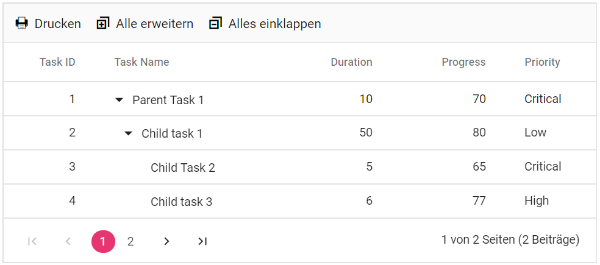
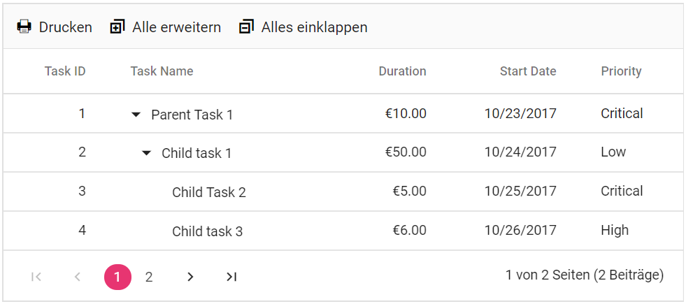

# Globalization

Add **UseRequestLocalization** middle-ware in Configure method in **Startup.cs** file to get browser Culture Info.

Refer the following code to add configuration in Startup.cs file

```csharp
using Microsoft.AspNetCore.Builder;
using Microsoft.AspNetCore.Localization;

namespace BlazorApplication
{
    public class Startup
    {
        ....
        ....

        public void Configure(IApplicationBuilder app, IWebHostEnvironment env)
        {
            app.UseRequestLocalization();
            ....
            ....
        }
    }
}
```

## Localization

The **Localization** library allows you to localize default text content of the Tree Grid. The Tree Grid component has static text on some features (like pager information text, context menu options text, etc.) that can be changed to other cultures (Arabic, Deutsch, French, etc.).

### Blazor Server Side

In the following examples, demonstrate how to enable **Localization** for Tree Grid in server side Blazor samples. Here, we have used Resource file to translate the static text of the Tree Grid.

The Resource file is an XML file which contains the strings(key and value pairs) that you want to translate into different language. You can also refer [`Localization`](https://docs.microsoft.com/en-us/aspnet/core/fundamentals/localization?view=aspnetcore-3.0) link to know more about how to configure and use localization in the ASP.Net Core application framework.

* Open the **Startup.cs** file and add the below configuration in the **ConfigureServices** function as follows.

```csharp
using Syncfusion.Blazor;
using System.Globalization;
using Microsoft.AspNetCore.Localization;

namespace BlazorApplication
{
    public class Startup
    {
        ....
        ....
        public void ConfigureServices(IServiceCollection services)
        {
            ....
            ....
            services.AddSyncfusionBlazor();
            services.AddLocalization(options => options.ResourcesPath = "Resources");
            services.Configure<RequestLocalizationOptions>(options =>
            {
                // define the list of cultures your app will support
                var supportedCultures = new List<CultureInfo>()
                {
                    new CultureInfo("de")
                };
                // set the default culture
                options.DefaultRequestCulture = new RequestCulture("de");
                options.SupportedCultures = supportedCultures;
                options.SupportedUICultures = supportedCultures;
                options.RequestCultureProviders = new List<IRequestCultureProvider>() {
                 new QueryStringRequestCultureProvider() // Here, You can also use other localization provider
                };
            });
            services.AddSingleton(typeof(ISyncfusionStringLocalizer), typeof(SampleLocalizer));
        }
    }
}
```

> Add [`UseRequestLocalization()`](https://docs.microsoft.com/en-us/aspnet/core/fundamentals/localization?view=aspnetcore-3.0#localization-middleware) middle-ware in Configure method in **Startup.cs** file to get browser Culture Information.

* Then, write a **class** by inheriting **ISyncfusionStringLocalizer** interface and override the Manager property to get the resource file details from the application end.

```csharp
using Syncfusion.Blazor;

namespace BlazorApplication
{
     public class SampleLocalizer : ISyncfusionStringLocalizer
    {

        public string Get(string key)
        {
            return this.Manager.GetString(key);
        }

        public System.Resources.ResourceManager Manager
        {
            get
            {
                return TreeGridBlazor.Resources.SyncfusionBlazorLocale.ResourceManager;
            }
        }
    }
}
```

* Add **.resx** file to [`Resource`](https://docs.microsoft.com/en-us/aspnet/core/fundamentals/localization?view=aspnetcore-3.0#resource-files) folder and enter the key value (Locale Keywords) in the **Name** column and the translated string in the **Value** column as follows.

Name |Value (in Deutsch culture)
-----|-----
Grid_Add | Hinzufügen.
Grid_AddFormTitle | Neuen Datensatz hinzufügen.
Grid_AND | UND.
Grid_AutoFit | Diese Spalte automatisch anpassen.
Grid_AutoFitAll | Automatisch alle Spalten anpassen.
Grid_BatchSaveConfirm | Möchten Sie die Änderungen wirklich speichern?.
Grid_BatchSaveLostChanges | Nicht gespeicherte Änderungen gehen verloren. Sind Sie sicher, dass Sie fortfahren wollen?
Grid_Between | Zwischen
Grid_Blanks| Leerzeichen
Grid_Cancel| Stornieren
Grid_CancelButton| Stornieren
Grid_CancelEdit | Möchten Sie die Änderungen wirklich abbrechen?
Grid_ChooseColumns | Spalte auswählen
Grid_ChooseDate | Wählen Sie ein Datum
Grid_ClearButton | klar
Grid_ClearFilter | Filter löschen
Grid_Columnchooser | Säulen
Grid_ConfirmDelete | Möchten Sie den Datensatz wirklich löschen?
Grid_Contains | Enthält
Grid_Copy | Kopieren
Grid_Csvexport | CSV-Export
Grid_CustomFilter | Benutzerdefinierte Filter
Grid_CustomFilterDatePlaceHolder | Wählen Sie ein Datum
Grid_CustomFilterPlaceHolder | Geben Sie den Wert ein
Grid_DateFilter | Datumsfilter
Grid_DateTimeFilter | DateTime-Filter
Grid_Delete | Löschen
Grid_DeleteOperationAlert | Keine Datensätze zum Löschen ausgewählt
Grid_DeleteRecord | Aufzeichnung löschen
Grid_Edit | Bearbeiten
Grid_EditFormTitle | Details von
Grid_EditOperationAlert | Keine Datensätze zum Bearbeiten ausgewählt
Grid_EditRecord | Datensatz bearbeiten
Grid_EmptyDataSourceError | DataSource darf beim ersten Laden nicht leer sein, da Spalten aus dataSource in AutoGenerate Column Grid generiert werden
Grid_EmptyRecord | Keine Datensätze zum Anzeigen
Grid_EndsWith | Endet mit
Grid_EnterValue | Geben Sie den Wert ein
Grid_Equal | Gleich
Grid_Excelexport | Excel-Export
Grid_Export | Export
Grid_False | falsch
Grid_FilterbarTitle | Filterbalkenzelle
Grid_FilterButton | Filter
Grid_FilterFalse | Falsch
Grid_FilterMenu | Filter
Grid_FilterTrue | Wahr
Grid_FirstPage | Erste Seite
Grid_GreaterThan | Größer als
Grid_GreaterThanOrEqual | Größer als oder gleich
Grid_InvalidFilterMessage | Ungültige Filterdaten
Grid_Item | Artikel
Grid_Items | Artikel
Grid_LastPage | Letzte Seite
Grid_LessThan | Weniger als
Grid_LessThanOrEqual | Weniger als oder gleich
Grid_MatchCase | Match-Fall
Grid_Matchs | Keine Treffer gefunden
Grid_NextPage | Nächste Seite
Grid_NoResult | Keine Treffer gefunden
Grid_NotEqual | Nicht gleich
Grid_NumberFilter | Anzahl Filter
Grid_OKButton | in Ordnung
Grid_OR | ODER
Grid_Pdfexport | PDF-Export
Grid_PreviousPage | Vorherige Seite
Grid_Print | Drucken
Grid_Save | speichern
Grid_SaveButton | speichern
Grid_Search | Suche
Grid_SearchColumns | Spalten durchsuchen
Grid_SelectAll | Wählen Sie Alle
Grid_ShowRowsWhere | Zeilen anzeigen, in denen:
Grid_SortAscending | Aufsteigend sortieren
Grid_SortDescending | Absteigend sortieren
Grid_StartsWith | Beginnt mit
Grid_TextFilter | Textfilter
Grid_True | wahr
Grid_Update | Aktualisieren
Grid_Wordexport | Word-Export
Pager_All | Alle
Pager_CurrentPageInfo | {0} von {1} Seiten
Pager_FirstPageTooltip | Gehe zur ersten Seite
Pager_LastPageTooltip | Gehe zur letzten Seite
Pager_NextPagerTooltip | Zum nächsten Pager gehen
Pager_NextPageTooltip | Gehe zur nächsten Seite
Pager_PagerAllDropDown | Artikel
Pager_PagerDropDown | Objekte pro Seite
Pager_PreviousPagerTooltip | Zum vorherigen Pager wechseln
Pager_PreviousPageTooltip |Zurück zur letzten Seite
Pager_TotalItemsInfo |({0} Artikel)

* Finally, Specify the culture for Tree Grid using [`locale`](https://help.syncfusion.com/cr/blazor/Syncfusion.Blazor~Syncfusion.Blazor.TreeGrid.SfTreeGrid%601~Locale.html) property.



@using TreeGridComponent.Data;
@using Syncfusion.Blazor.TreeGrid;

<SfTreeGrid DataSource="@TreeGridData" AllowPaging="true" Locale="de-DE" IdMapping="TaskId" AllowSelection="true" ParentIdMapping="ParentId" TreeColumnIndex="1"
             Toolbar="@(new List<string>() { "Print", "ExpandAll", "CollapseAll" })">
    <TreeGridPageSettings PageSize="1"></TreeGridPageSettings>
    <TreeGridColumns>
        <TreeGridColumn Field="TaskId" HeaderText="Task ID" Width="80" TextAlign="Syncfusion.Blazor.Grids.TextAlign.Right"></TreeGridColumn>
        <TreeGridColumn Field="TaskName" HeaderText="Task Name" Width="160"></TreeGridColumn>
        <TreeGridColumn Field="Duration" HeaderText="Duration" Width="100" TextAlign="Syncfusion.Blazor.Grids.TextAlign.Right"></TreeGridColumn>
        <TreeGridColumn Field="Progress" HeaderText="Progress" Width="100" TextAlign="Syncfusion.Blazor.Grids.TextAlign.Right"></TreeGridColumn>
        <TreeGridColumn Field="Priority" HeaderText="Priority" Width="80"></TreeGridColumn>
    </TreeGridColumns>
</SfTreeGrid>

@code{
    [Inject]
    IJSRuntime JsRuntime { get; set; }

    public List<TreeData> TreeGridData { get; set; }

    protected override void OnInitialized()
    {
        this.TreeGridData = TreeData.GetSelfDataSource().ToList();
    }

    protected override void OnAfterRender(bool firstRender)
    {
        if (firstRender)
        {
            this.JsRuntime.Sf().LoadLocaleData("locale.json").SetCulture("de-DE");
        }
    }
}




### Blazor WebAssembly

For Blazor WebAssembly, we use **JSON** file which contains translated text of the culture.

The following list of properties and its values are used in the Tree Grid.

Locale keywords |Text
-----|-----
EmptyRecord |No records to display.
True |true
False |false
InvalidFilterMessage |Invalid filter data.
GroupDropArea |Drag a column header here to group its column.
UnGroup |Click here to ungroup.
GroupDisable |Grouping is disabled for this column.
FilterbarTitle |\s filter bar cell.
EmptyDataSourceError |DataSource must not be empty at initial load as columns are generated from the dataSource in AutoGenerate Column Tree Grid.
Add | Add
Edit| Edit
Cancel| Cancel
Update| Update
Delete | Delete
Print | Print
Pdfexport | PDF Export
Excelexport | Excel Export
Wordexport | Word Export
Csvexport | CSV Export
Search | Search
Columnchooser | Columns
Save | Save
Item | item
Items | items
EditOperationAlert | No records selected for edit operation
DeleteOperationAlert | No records selected for delete operation
SaveButton | Save
OKButton | OK
CancelButton | Cancel
EditFormTitle | Details of
AddFormTitle | Add New Record
BatchSaveConfirm | Are you sure you want to save changes?
BatchSaveLostChanges | Unsaved changes will be lost. Are you sure you want to continue?
ConfirmDelete | Are you sure you want to Delete Record?
CancelEdit | Are you sure you want to Cancel the changes?
ChooseColumns | Choose Column
SearchColumns | search columns
Matchs | No Matches Found
FilterButton | Filter
ClearButton | Clear
StartsWith | Starts With
EndsWith | Ends With
Contains | Contains
Equal | Equal
NotEqual | Not Equal
LessThan | Less Than
LessThanOrEqual | Less Than Or Equal
GreaterThan | Greater Than
GreaterThanOrEqual | Greater Than Or Equal
ChooseDate | Choose a Date
EnterValue | Enter the value
Copy | Copy
Group | Group by this column
Ungroup | Ungroup by this column
autoFitAll | AutoFit all columns
autoFit | AutoFit this column
Export | Export
FirstPage | First Page
LastPage | Last Page
PreviousPage | Previous Page
NextPage | Next Page
SortAscending | Sort Ascending
SortDescending | Sort Descending
EditRecord | Edit Record
DeleteRecord | Delete Record
FilterMenu | Filter
SelectAll | Select All
Blanks | Blanks
FilterTrue | True
FilterFalse | False
NoResult | No Matches Found
ClearFilter | Clear Filter
NumberFilter | Number Filters
TextFilter | Text Filters
DateFilter | Date Filters
MatchCase | Match Case
Between | Between
CustomFilter | Custom Filter
CustomFilterPlaceHolder | Enter the value
CustomFilterDatePlaceHolder | Choose a date
AND | AND
OR | OR
ShowRowsWhere | Show rows where
currentPageInfo | {0} of {1} pages
totalItemsInfo | ({0} items)
firstPageTooltip | Go to first page
lastPageTooltip | Go to last page
nextPageTooltip | Go to next page
previousPageTooltip | Go to previous page
nextPagerTooltip | Go to next pager
previousPagerTooltip | Go to previous pager
pagerDropDown | Items per page
pagerAllDropDown | Items
All | All

### Loading translations

The following example demonstrates the Tree Grid in **Deutsch** culture. Here we use **LoadLocaleData** method to load the **locale.json** file and **SetCulture** method to set the culture of the Tree Grid.



@using TreeGridComponent.Data;
@using Syncfusion.Blazor.TreeGrid;

<SfTreeGrid DataSource="@TreeGridData" AllowPaging="true" Locale="de-DE" IdMapping="TaskId" AllowSelection="true" ParentIdMapping="ParentId" TreeColumnIndex="1"
             Toolbar="@(new List<string>() { "Print", "ExpandAll", "CollapseAll" })">
    <TreeGridPageSettings PageSize="1"></TreeGridPageSettings>
    <TreeGridColumns>
        <TreeGridColumn Field="TaskId" HeaderText="Task ID" Width="80" TextAlign="Syncfusion.Blazor.Grids.TextAlign.Right"></TreeGridColumn>
        <TreeGridColumn Field="TaskName" HeaderText="Task Name" Width="160"></TreeGridColumn>
        <TreeGridColumn Field="Duration" HeaderText="Duration" Width="100" TextAlign="Syncfusion.Blazor.Grids.TextAlign.Right"></TreeGridColumn>
        <TreeGridColumn Field="Progress" HeaderText="Progress" Width="100" TextAlign="Syncfusion.Blazor.Grids.TextAlign.Right"></TreeGridColumn>
        <TreeGridColumn Field="Priority" HeaderText="Priority" Width="80"></TreeGridColumn>
    </TreeGridColumns>
</SfTreeGrid>

@code{
    [Inject]
    IJSRuntime JsRuntime { get; set; }

    public List<TreeData> TreeGridData { get; set; }

    protected override void OnInitialized()
    {
        this.TreeGridData = TreeData.GetSelfDataSource().ToList();
    }

    protected override void OnAfterRender(bool firstRender)
    {
        if (firstRender)
        {
            this.JsRuntime.Sf().LoadLocaleData("locale.json").SetCulture("de-DE");
        }
    }
}




The following output is displayed as a result of the above code example.



## Internationalization

The **Internationalization** library is used to globalize number, date, and time values in Tree Grid component using format strings in the **Format**. In the below sample we set the culture and currency using the **SetCulture** and **SetCurrencyCode** methods.



@using TreeGridComponent.Data;
@using Microsoft.JSInterop
@using Syncfusion.Blazor.TreeGrid;

<SfTreeGrid DataSource="@TreeGridData" AllowPaging="true" Locale="de-DE" IdMapping="TaskId" AllowSelection="true" ParentIdMapping="ParentId" TreeColumnIndex="1"
             Toolbar="@(new List<string>() { "Print", "ExpandAll", "CollapseAll" })">
    <TreeGridPageSettings PageSize="1"></TreeGridPageSettings>
    <TreeGridColumns>
        <TreeGridColumn Field="TaskId" HeaderText="Task ID" Width="80" TextAlign="Syncfusion.Blazor.Grids.TextAlign.Right"></TreeGridColumn>
        <TreeGridColumn Field="TaskName" HeaderText="Task Name" Width="160"></TreeGridColumn>
        <TreeGridColumn Field="Duration" HeaderText="Duration" Width="100" Format="C2" TextAlign="Syncfusion.Blazor.Grids.TextAlign.Right"></TreeGridColumn>
        <TreeGridColumn Field="StartDate" HeaderText=" Start Date" Format="yMd" Type="Syncfusion.Blazor.Grids.ColumnType.Date" TextAlign="Syncfusion.Blazor.Grids.TextAlign.Right" Width="100"></TreeGridColumn>
        <TreeGridColumn Field="Priority" HeaderText="Priority" Width="80"></TreeGridColumn>
    </TreeGridColumns>
</SfTreeGrid>

@code{
    [Inject]
    IJSRuntime JsRuntime { get; set; }

    public List<TreeData> TreeGridData { get; set; }

    protected override void OnInitialized()
    {
        this.TreeGridData = TreeData.GetSelfDataSource().ToList();
    }

    protected override void OnAfterRender(bool firstRender)
    {
        if (firstRender)
        {
            this.JsRuntime.Sf().SetCulture("de-DE").SetCurrencyCode("EUR");
        }
    }
}



The following output is displayed as a result of the above code example.



> * In the above sample, **Duration** column is formatted by **NumberFormatOptions**.
> * By default, **locale** value is **en-US**. If you want to change the **en-US** culture to a different culture, you have to set accordingly in **SetCulture** method.

## Right to left (RTL)

RTL provides an option to switch the text direction and layout of the Tree Grid component from right to left. It improves the user experiences and accessibility for users who use right-to-left languages (Arabic, Farsi, Urdu, etc.). In the Below sample **EnableRtl** method is used to enable RTL in the Tree Grid.



@using TreeGridComponent.Data;
@using Syncfusion.Blazor.TreeGrid;

<SfTreeGrid DataSource="@TreeGridData" AllowPaging="true" Locale="ar-AE" IdMapping="TaskId" AllowSelection="true" ParentIdMapping="ParentId" TreeColumnIndex="1"
             Toolbar="@(new List<string>() { "Print", "ExpandAll", "CollapseAll" })">
    <TreeGridPageSettings PageSize="1"></TreeGridPageSettings>
    <TreeGridColumns>
        <TreeGridColumn Field="TaskId" HeaderText="Task ID" Width="80" TextAlign="Syncfusion.Blazor.Grids.TextAlign.Right"></TreeGridColumn>
        <TreeGridColumn Field="TaskName" HeaderText="Task Name" Width="160"></TreeGridColumn>
        <TreeGridColumn Field="Duration" HeaderText="Duration" Width="100" Format="C2" TextAlign="Syncfusion.Blazor.Grids.TextAlign.Right"></TreeGridColumn>
        <TreeGridColumn Field="StartDate" HeaderText=" Start Date" Format="yMd" Type="Syncfusion.Blazor.Grids.ColumnType.Date" TextAlign="Syncfusion.Blazor.Grids.TextAlign.Right" Width="100"></TreeGridColumn>
        <TreeGridColumn Field="Priority" HeaderText="Priority" Width="80"></TreeGridColumn>
    </TreeGridColumns>
</SfTreeGrid>

@code{
    [Inject]
    IJSRuntime JsRuntime { get; set; }

    public List<TreeData> TreeGridData { get; set; }

    protected override void OnInitialized()
    {
        this.TreeGridData = TreeData.GetSelfDataSource().ToList();
    }

    protected override void OnAfterRender(bool firstRender)
    {
        if (firstRender)
        {
            this.JsRuntime.Sf().EnableRtl(true);
        }
    }
}



The following output is displayed as a result of the above code example.


