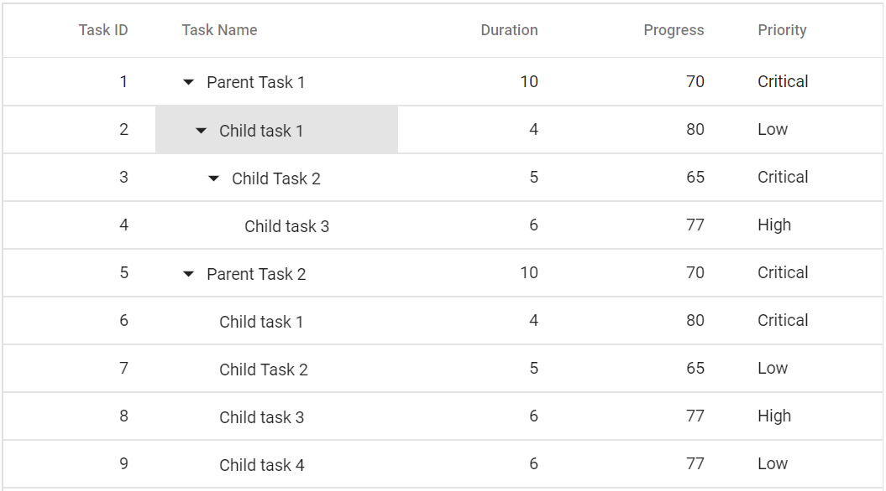
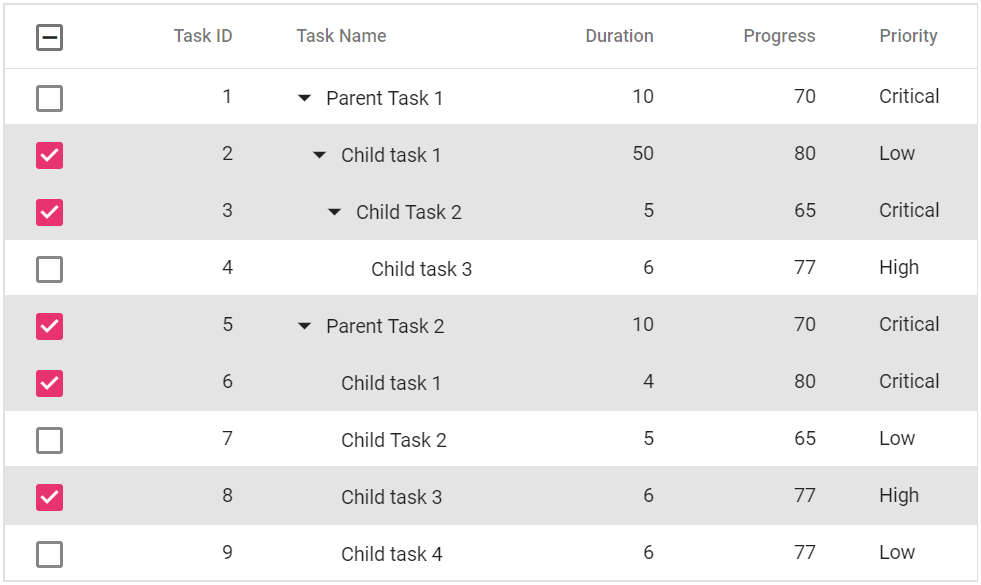
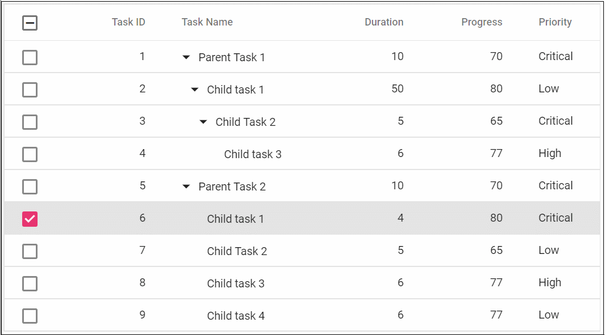
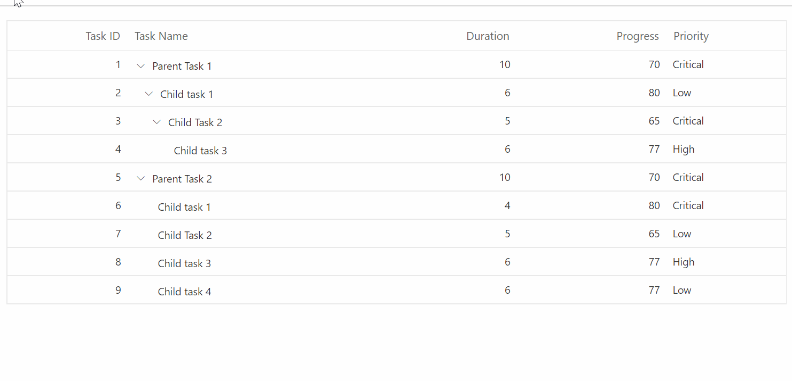

# Selection

Selection provides an option to highlight a row or a cell. It can be done through simple mouse down or arrow keys. To disable selection in the Tree Grid, set the [`AllowSelection`](https://help.syncfusion.com/cr/blazor/Syncfusion.Blazor~Syncfusion.Blazor.TreeGrid.SfTreeGrid~AllowSelection.html) to false.

The tree grid supports two types of selection that can be set by using the [`Type`](https://help.syncfusion.com/cr/blazor/Syncfusion.Blazor~Syncfusion.Blazor.TreeGrid.TreeGridSelectionSettings~Type.html) property in [`TreeGridSelectionSettings`](https://help.syncfusion.com/cr/blazor/Syncfusion.Blazor~Syncfusion.Blazor.TreeGrid.TreeGridSelectionSettings.html). They are:

* **Single**: The Single value is set by default, and it only allows selection of a single row or a cell.

* **Multiple**: Allows you to select multiple rows or cells.
To perform the multi-selection, press and hold CTRL key and click the desired rows or cells. To select range of rows or cells, press and hold the SHIFT key and click the rows or cells.



@using TreeGridComponent.Data;
@using Syncfusion.Blazor.TreeGrid;

<SfTreeGrid DataSource="@TreeGridData" IdMapping="TaskId" AllowSelection="true" ParentIdMapping="ParentId" TreeColumnIndex="1">
    <TreeGridSelectionSettings Type="Syncfusion.Blazor.Grids.SelectionType.Multiple"></TreeGridSelectionSettings>
    <TreeGridColumns>
        <TreeGridColumn Field="TaskId" HeaderText="Task ID" Width="80" TextAlign="Syncfusion.Blazor.Grids.TextAlign.Right"></TreeGridColumn>
        <TreeGridColumn Field="TaskName" HeaderText="Task Name" Width="160"></TreeGridColumn>
        <TreeGridColumn Field="Duration" HeaderText="Duration" Width="100" TextAlign="Syncfusion.Blazor.Grids.TextAlign.Right"></TreeGridColumn>
        <TreeGridColumn Field="Progress" HeaderText="Progress" Width="100" TextAlign="Syncfusion.Blazor.Grids.TextAlign.Right"></TreeGridColumn>
        <TreeGridColumn Field="Priority" HeaderText="Priority" Width="80"></TreeGridColumn>
    </TreeGridColumns>
</SfTreeGrid>

@code{
    public List<TreeData.BusinessObject> TreeGridData { get; set; }
    protected override void OnInitialized()
    {
        this.TreeGridData = TreeData.GetSelfDataSource().ToList();
    }
}



## Selection mode

The tree grid supports three types of selection mode that can be set by using
the [`Mode`](https://help.syncfusion.com/cr/blazor/Syncfusion.Blazor~Syncfusion.Blazor.TreeGrid.TreeGridSelectionSettings~Mode.html) property of [`TreeGridSelectionSettings`](https://help.syncfusion.com/cr/blazor/Syncfusion.Blazor~Syncfusion.Blazor.TreeGrid.TreeGridSelectionSettings.html). They are:

* **Row**: The Row value is set by default, and allows you to select only rows.
* **Cell**: Allows you to select only cells.
* **Both**: Allows you to select rows and cells at the same time.



@using TreeGridComponent.Data;
@using Syncfusion.Blazor.TreeGrid;
@using Syncfusion.Blazor.Grids;

<SfTreeGrid DataSource="@TreeGridData" IdMapping="TaskId" AllowSelection="true" ParentIdMapping="ParentId" TreeColumnIndex="1">
    <TreeGridSelectionSettings Type="SelectionType.Multiple" Mode="Syncfusion.Blazor.Grids.SelectionMode.Cell">
    </TreeGridSelectionSettings>
    <TreeGridColumns>
        <TreeGridColumn Field="TaskId" HeaderText="Task ID" Width="80" TextAlign="Syncfusion.Blazor.Grids.TextAlign.Right"></TreeGridColumn>
        <TreeGridColumn Field="TaskName" HeaderText="Task Name" Width="160"></TreeGridColumn>
        <TreeGridColumn Field="Duration" HeaderText="Duration" Width="100" TextAlign="Syncfusion.Blazor.Grids.TextAlign.Right"></TreeGridColumn>
        <TreeGridColumn Field="Progress" HeaderText="Progress" Width="100" TextAlign="Syncfusion.Blazor.Grids.TextAlign.Right"></TreeGridColumn>
        <TreeGridColumn Field="Priority" HeaderText="Priority" Width="80"></TreeGridColumn>
    </TreeGridColumns>
</SfTreeGrid>

@code{
    public List<TreeData.BusinessObject> TreeGridData { get; set; }
    protected override void OnInitialized()
    {
        this.TreeGridData = TreeData.GetSelfDataSource().ToList();
    }
}



The following output is displayed as a result of the above code example.

## Cell selection

Cell selection can be done through simple mouse down or arrow keys (up, down, left, and right).

The tree grid supports two types of cell selection mode that can be set by using
the [`CellSelectionMode`](https://help.syncfusion.com/cr/blazor/Syncfusion.Blazor~Syncfusion.Blazor.TreeGrid.TreeGridSelectionSettings~CellSelectionMode.html) property of [`TreeGridSelectionSettings`](https://help.syncfusion.com/cr/blazor/Syncfusion.Blazor~Syncfusion.Blazor.TreeGrid.TreeGridSelectionSettings.html). They are:

* **Flow**: The Flow value is set by default. The range of cells are selected between the start index and end index that includes in between cells of rows.
* **Box**: Range of cells are selected from the start and end column indexes that includes in between cells of rows within the range.



@using TreeGridComponent.Data;
@using Syncfusion.Blazor.TreeGrid;
@using Syncfusion.Blazor.Grids;

<SfTreeGrid DataSource="@TreeGridData" IdMapping="TaskId" AllowSelection="true" ParentIdMapping="ParentId" TreeColumnIndex="1">
    <TreeGridSelectionSettings Type="SelectionType.Multiple" Mode="Syncfusion.Blazor.Grids.SelectionMode.Cell" CellSelectionMode="CellSelectionMode.Box"></TreeGridSelectionSettings>
    <TreeGridColumns>
        <TreeGridColumn Field="TaskId" HeaderText="Task ID" Width="80" TextAlign="Syncfusion.Blazor.Grids.TextAlign.Right"></TreeGridColumn>
        <TreeGridColumn Field="TaskName" HeaderText="Task Name" Width="160"></TreeGridColumn>
        <TreeGridColumn Field="Duration" HeaderText="Duration" Width="100" TextAlign="Syncfusion.Blazor.Grids.TextAlign.Right"></TreeGridColumn>
        <TreeGridColumn Field="Progress" HeaderText="Progress" Width="100" TextAlign="Syncfusion.Blazor.Grids.TextAlign.Right"></TreeGridColumn>
        <TreeGridColumn Field="Priority" HeaderText="Priority" Width="80"></TreeGridColumn>
    </TreeGridColumns>
</SfTreeGrid>

@code{
    public List<TreeData.BusinessObject> TreeGridData { get; set; }
    protected override void OnInitialized()
    {
        this.TreeGridData = TreeData.GetSelfDataSource().ToList();
    }
}



The following output is displayed as a result of the above code example.

> Cell selection requires the [`Mode`](https://help.syncfusion.com/cr/blazor/Syncfusion.Blazor~Syncfusion.Blazor.TreeGrid.TreeGridSelectionSettings~Mode.html) to be **Cell** or **Both**, and
**Type** should be **Multiple**.

## Checkbox selection

Checkbox selection provides an option to select multiple tree grid records with help of checkbox in each row.

To render the checkbox in each tree grid row, you need to use checkbox column with type as **checkbox** using the column [`Type`](https://help.syncfusion.com/cr/blazor/Syncfusion.Blazor~Syncfusion.Blazor.TreeGrid.TreeGridColumn~Type.html) property.



@using TreeGridComponent.Data;
@using Syncfusion.Blazor.TreeGrid;

<SfTreeGrid DataSource="@TreeGridData" IdMapping="TaskId" AllowSelection="true" ParentIdMapping="ParentId" TreeColumnIndex="2">
    <TreeGridColumns>
        <TreeGridColumn Type="Syncfusion.Blazor.Grids.ColumnType.CheckBox" Width="80"></TreeGridColumn>
        <TreeGridColumn Field="TaskId" HeaderText="Task ID" Width="80" TextAlign="Syncfusion.Blazor.Grids.TextAlign.Right"></TreeGridColumn>
        <TreeGridColumn Field="TaskName" HeaderText="Task Name" Width="160"></TreeGridColumn>
        <TreeGridColumn Field="Duration" HeaderText="Duration" Width="100" TextAlign="Syncfusion.Blazor.Grids.TextAlign.Right"></TreeGridColumn>
        <TreeGridColumn Field="Progress" HeaderText="Progress" Width="100" TextAlign="Syncfusion.Blazor.Grids.TextAlign.Right"></TreeGridColumn>
        <TreeGridColumn Field="Priority" HeaderText="Priority" Width="80"></TreeGridColumn>
    </TreeGridColumns>
</SfTreeGrid>

@code{
    public List<TreeData> TreeGridData { get; set; }
    protected override void OnInitialized()
    {
        this.TreeGridData = TreeData.GetSelfDataSource().ToList();
    }
}



The following output is displayed as a result of the above code example.

> * By default, selection is allowed by clicking a tree grid row or checkbox in that row. To allow selection only through checkbox, you can set the
[`CheckboxOnly`](https://help.syncfusion.com/cr/blazor/Syncfusion.Blazor~Syncfusion.Blazor.TreeGrid.TreeGridSelectionSettings~CheckboxOnly.html) property of [`TreeGridSelectionSettings`](https://help.syncfusion.com/cr/blazor/Syncfusion.Blazor~Syncfusion.Blazor.TreeGrid.TreeGridSelectionSettings.html) to true.
> * Selection can be persisted in all the operations using the [`PersistSelection`](https://help.syncfusion.com/cr/blazor/Syncfusion.Blazor~Syncfusion.Blazor.TreeGrid.TreeGridSelectionSettings~PersistSelection.html) property of [`TreeGridSelectionSettings`](https://help.syncfusion.com/cr/blazor/Syncfusion.Blazor~Syncfusion.Blazor.TreeGrid.TreeGridSelectionSettings.html).
For persisting selection on the tree grid, any one of the columns should be defined as a primary key using the [`IsPrimaryKey`](https://help.syncfusion.com/cr/blazor/Syncfusion.Blazor~Syncfusion.Blazor.TreeGrid.TreeGridColumn~IsPrimaryKey.html) property of [`TreeGridColumn`](https://help.syncfusion.com/cr/blazor/Syncfusion.Blazor~Syncfusion.Blazor.TreeGrid.TreeGridColumn.html).

### Checkbox selection Mode

In checkbox selection, selection can also be done by clicking on rows. This selection provides two types of Checkbox Selection mode which can be set by using the following API,
[`CheckboxMode`](https://help.syncfusion.com/cr/blazor/Syncfusion.Blazor~Syncfusion.Blazor.TreeGrid.TreeGridSelectionSettings~CheckboxMode.html) in [`TreeGridSelectionSettings`](https://help.syncfusion.com/cr/blazor/Syncfusion.Blazor~Syncfusion.Blazor.TreeGrid.TreeGridSelectionSettings.html). The modes are;

* **Default**: This is the default value of the checkboxMode. In this mode, user can select multiple rows by clicking rows one by one.
* **ResetOnRowClick**: In ResetOnRowClick mode, when user clicks on a row it will reset previously selected row. Also you can perform multiple-selection in this mode by press
and hold CTRL key and click the desired rows. To select range of rows, press and hold the SHIFT key and click the rows.



@using TreeGridComponent.Data;
@using Syncfusion.Blazor.TreeGrid;

<SfTreeGrid DataSource="@TreeGridData" IdMapping="TaskId" AllowSelection="true" ParentIdMapping="ParentId" TreeColumnIndex="2">
    <TreeGridSelectionSettings CheckboxMode="CheckboxSelectionType.ResetOnRowClick"></TreeGridSelectionSettings>
    <TreeGridColumns>
        <TreeGridColumn Type="Syncfusion.Blazor.Grids.ColumnType.CheckBox" Width="80"></TreeGridColumn>
        <TreeGridColumn Field="TaskId" HeaderText="Task ID" Width="80" TextAlign="Syncfusion.Blazor.Grids.TextAlign.Right"></TreeGridColumn>
        <TreeGridColumn Field="TaskName" HeaderText="Task Name" Width="160"></TreeGridColumn>
        <TreeGridColumn Field="Duration" HeaderText="Duration" Width="100" TextAlign="Syncfusion.Blazor.Grids.TextAlign.Right"></TreeGridColumn>
        <TreeGridColumn Field="Progress" HeaderText="Progress" Width="100" TextAlign="Syncfusion.Blazor.Grids.TextAlign.Right"></TreeGridColumn>
        <TreeGridColumn Field="Priority" HeaderText="Priority" Width="80"></TreeGridColumn>
    </TreeGridColumns>
</SfTreeGrid>

@code{
    public List<TreeData> TreeGridData { get; set; }
    protected override void OnInitialized()
    {
        this.TreeGridData = TreeData.GetSelfDataSource().ToList();
    }
}



The following output is displayed as a result of the above code example.

## Toggle Selection

The Toggle selection allows to perform selection and unselection of the particular row or cell. To enable toggle selection, set [`EnableToggle`](https://help.syncfusion.com/cr/blazor/Syncfusion.Blazor~Syncfusion.Blazor.TreeGrid.TreeGridSelectionSettings~EnableToggle.html) property of TreeGridSelectionSettings as true. If you click on the selected row or cell then it will be unselected and vice versa.



@using TreeGridComponent.Data;
@using Syncfusion.Blazor.TreeGrid;

<SfTreeGrid @ref="TreeGrid" DataSource="@TreeGridData" IdMapping="TaskId" AllowSelection="true" ParentIdMapping="ParentId" TreeColumnIndex="1">
    <TreeGridSelectionSettings  EnableToggle="true" Type="SelectionType.Multiple"></TreeGridSelectionSettings>
    <TreeGridColumns>
        <TreeGridColumn Field="TaskId" HeaderText="Task ID" Width="80" TextAlign="Syncfusion.Blazor.Grids.TextAlign.Right"></TreeGridColumn>
        <TreeGridColumn Field="TaskName" HeaderText="Task Name" Width="160"></TreeGridColumn>
        <TreeGridColumn Field="Duration" HeaderText="Duration" Width="100" TextAlign="Syncfusion.Blazor.Grids.TextAlign.Right"></TreeGridColumn>
        <TreeGridColumn Field="Progress" HeaderText="Progress" Width="100" TextAlign="Syncfusion.Blazor.Grids.TextAlign.Right"></TreeGridColumn>
        <TreeGridColumn Field="Priority" HeaderText="Priority" Width="80"></TreeGridColumn>
    </TreeGridColumns>
</SfTreeGrid>

@code{
    public List<TreeData> TreeGridData { get; set; }

    SfTreeGrid<TreeData> TreeGrid;

    protected override void OnInitialized()
    {
        this.TreeGridData = TreeData.GetSelfDataSource().ToList();
    }

}



The following output is displayed as a result of the above code example.

>If multi selection is enabled, then first click on any selected row (without pressing Ctrl key), it will clear the multi selection and in second click on the same row, it will be unselected.

## Select row at initial rendering

To select a row at initial rendering, set the [SelectedRowIndex](https://help.syncfusion.com/cr/blazor/Syncfusion.Blazor~Syncfusion.Blazor.TreeGrid.SfTreeGrid~SelectedRowIndex.html) value.



@using TreeGridComponent.Data;
@using Syncfusion.Blazor.TreeGrid;

<SfTreeGrid DataSource="@TreeGridData" IdMapping="TaskId" AllowSelection="true" ParentIdMapping="ParentId" TreeColumnIndex="1" SelectedRowIndex="1">
    <TreeGridColumns>
        <TreeGridColumn Field="TaskId" HeaderText="Task ID" Width="80" TextAlign="Syncfusion.Blazor.Grids.TextAlign.Right"></TreeGridColumn>
        <TreeGridColumn Field="TaskName" HeaderText="Task Name" Width="160"></TreeGridColumn>
        <TreeGridColumn Field="Duration" HeaderText="Duration" Width="100" TextAlign="Syncfusion.Blazor.Grids.TextAlign.Right"></TreeGridColumn>
        <TreeGridColumn Field="Progress" HeaderText="Progress" Width="100" TextAlign="Syncfusion.Blazor.Grids.TextAlign.Right"></TreeGridColumn>
        <TreeGridColumn Field="Priority" HeaderText="Priority" Width="80"></TreeGridColumn>
    </TreeGridColumns>
</SfTreeGrid>

@code{
    public List<TreeData.BusinessObject> TreeGridData { get; set; }
    protected override void OnInitialized()
    {
        this.TreeGridData = TreeData.GetSelfDataSource().ToList();
    }
}



The following output is displayed as a result of the above code example.

## Get selected row indexes

You can get the selected row indexes by using the GetSelectedRowIndexes method.



@using TreeGridComponent.Data;
@using Syncfusion.Blazor.TreeGrid;

<SfTreeGrid @ref="TreeGrid" DataSource="@TreeGridData" IdMapping="TaskId" AllowSelection="true" ParentIdMapping="ParentId" TreeColumnIndex="1">
    <TreeGridEvents RowSelected="RowSelectHandler" TValue="TreeData"></TreeGridEvents>
    <TreeGridColumns>
        <TreeGridColumn Field="TaskId" HeaderText="Task ID" Width="80" TextAlign="Syncfusion.Blazor.Grids.TextAlign.Right"></TreeGridColumn>
        <TreeGridColumn Field="TaskName" HeaderText="Task Name" Width="160"></TreeGridColumn>
        <TreeGridColumn Field="Duration" HeaderText="Duration" Width="100" TextAlign="Syncfusion.Blazor.Grids.TextAlign.Right"></TreeGridColumn>
        <TreeGridColumn Field="Progress" HeaderText="Progress" Width="100" TextAlign="Syncfusion.Blazor.Grids.TextAlign.Right"></TreeGridColumn>
        <TreeGridColumn Field="Priority" HeaderText="Priority" Width="80"></TreeGridColumn>
    </TreeGridColumns>
</SfTreeGrid>

@code{
    public List<TreeData> TreeGridData { get; set; }

    SfTreeGrid<TreeData> TreeGrid;

    public List<double> SelectedRowIndexes { get; set; }

    public List<TreeData> SelectedRecords { get; set; }

    protected override void OnInitialized()
    {
        this.TreeGridData = TreeData.GetSelfDataSource().ToList();
    }

    private async void RowSelectHandler(RowSelectEventArgs<TreeData> Args)
    {
        this.SelectedRowIndexes = await this.TreeGrid.GetSelectedRowIndexes();   /// get the selected row indexes

        string index = JsonConvert.SerializeObject(this.SelectedRowIndexes);    
        JsRuntime.InvokeAsync<string>("window.alert", index);

        this.SelectedRecords = await this.TreeGrid.GetSelectedRecords();   /// get the selected records

        string records = JsonConvert.SerializeObject(this.SelectedRecords);
        JsRuntime.InvokeAsync<string>("window.alert", records);
    }
}



## Touch interaction

When you tap a tree grid row on touchscreen device, the tapped row is selected.
It also shows a popup   for multi-row selection.
To select multiple rows or cells, tap the popup  and then tap the desired rows or cells.

> Multi-selection requires the selection [`Type`](https://help.syncfusion.com/cr/blazor/Syncfusion.Blazor~Syncfusion.Blazor.TreeGrid.TreeGridSelectionSettings~Type.html) to be **Multiple**.

The following screenshot represents a tree grid touch selection in the device.

<!-- markdownlint-disable MD033 -->

<!-- markdownlint-enable MD033 -->
