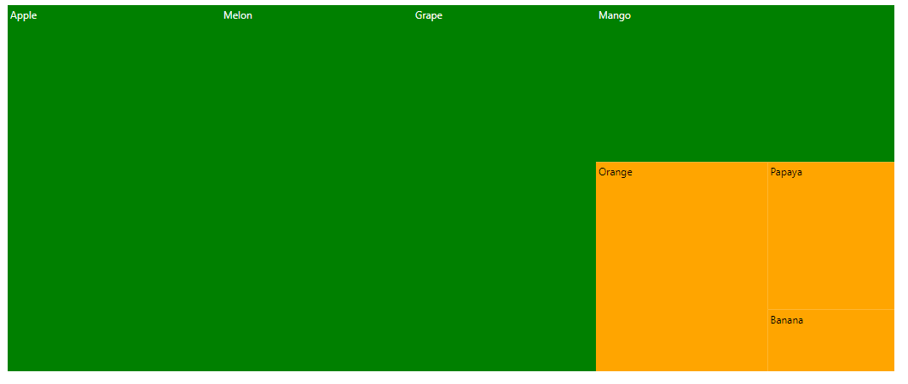
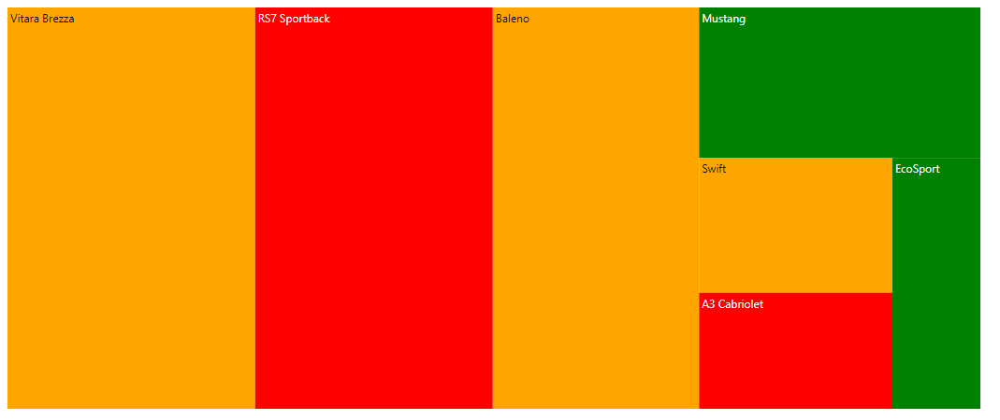
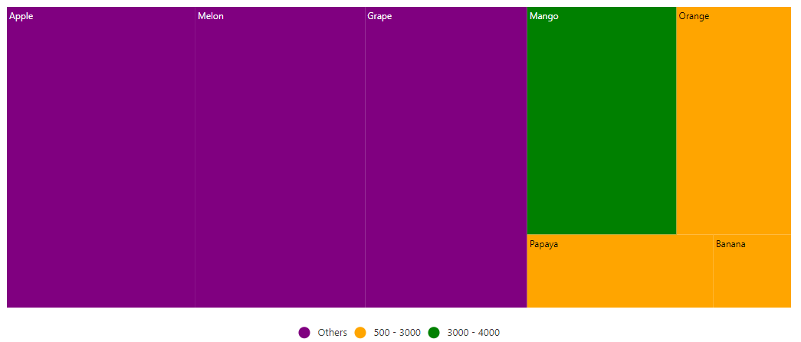

# Color Mapping in Blazor TreeMap Component

Color mapping is used to customize the color for each group or item based on the specified types. The following options are available to customize the group and leaf items in the TreeMap component.

## Range color mapping

Range color mapping is used to apply color to the items by giving specific ranges in the [`DataSource`](https://help.syncfusion.com/cr/blazor/Syncfusion.Blazor.TreeMap.SfTreeMap-1.html#Syncfusion_Blazor_TreeMap_SfTreeMap_1_DataSource), and it should be specifying the data source properties to the [`RangeColorValuePath`](https://help.syncfusion.com/cr/blazor/Syncfusion.Blazor.TreeMap.SfTreeMap-1.html#Syncfusion_Blazor_TreeMap_SfTreeMap_1_RangeColorValuePath). The color mapping ranges to be specified in the [`StartRange`](https://help.syncfusion.com/cr/blazor/Syncfusion.Blazor.TreeMap.ColorMapping.html#Syncfusion_Blazor_TreeMap_ColorMapping_StartRange) and the [`EndRange`](https://help.syncfusion.com/cr/blazor/Syncfusion.Blazor.TreeMap.ColorMapping.html#Syncfusion_Blazor_TreeMap_ColorMapping_EndRange) properties of the [`TreeMapLeafColorMappings`](https://help.syncfusion.com/cr/blazor/Syncfusion.Blazor.TreeMap.TreeMapLeafColorMapping.html).

The following code example shows, how to apply range color mapping.

```cshtml
@using Syncfusion.Blazor.TreeMap

<SfTreeMap WeightValuePath="Count" TValue="Fruit" DataSource="Fruits" RangeColorValuePath="Count">
    <TreeMapLeafItemSettings LabelPath="FruitName">
        <TreeMapLeafColorMappings>
            <TreeMapLeafColorMapping StartRange="500" EndRange="3000" Color='new string[] { "Orange" }'></TreeMapLeafColorMapping>
            <TreeMapLeafColorMapping StartRange="3000" EndRange="5000" Color='new string[] { "Green" }'></TreeMapLeafColorMapping>
        </TreeMapLeafColorMappings>
    </TreeMapLeafItemSettings>
</SfTreeMap>

@code {
    public class Fruit
    {
        public string FruitName { get; set; }
        public double Count { get; set; }
    };
    public List<Fruit> Fruits = new List<Fruit> {
        new Fruit { FruitName="Apple", Count=5000 },
        new Fruit { FruitName="Mango", Count=3000 },
        new Fruit { FruitName="Orange", Count=2300 },
        new Fruit { FruitName="Banana", Count=500 },
        new Fruit { FruitName="Grape", Count=4300 },
        new Fruit { FruitName="Papaya", Count=1200 },
        new Fruit { FruitName="Melon", Count=4500 }
    };
}
```



## Equal color mapping

Equal color mapping is used to fill colors to each item by specifying equal value present in the data source, that can be specified in the [`EqualColorValuePath`](https://help.syncfusion.com/cr/blazor/Syncfusion.Blazor.TreeMap.SfTreeMap-1.html#Syncfusion_Blazor_TreeMap_SfTreeMap_1_EqualColorValuePath) property.

The following code example shows, how to apply equal color mapping.

```cshtml
@using Syncfusion.Blazor.TreeMap

<SfTreeMap WeightValuePath="Count" TValue="Car" DataSource="Cars" EqualColorValuePath="Brand">
    <TreeMapLeafItemSettings LabelPath="Name">
        <TreeMapLeafColorMappings>
            <TreeMapLeafColorMapping Value="Ford" Color='new string[] { "green" }'></TreeMapLeafColorMapping>
            <TreeMapLeafColorMapping Value="Audi" Color='new string[] { "red" }'></TreeMapLeafColorMapping>
            <TreeMapLeafColorMapping Value="Maruti" Color='new string[] { "orange"}'></TreeMapLeafColorMapping>
        </TreeMapLeafColorMappings>
    </TreeMapLeafItemSettings>
</SfTreeMap>

@code {
    public class Car
    {
        public string Name { get; set; }
        public int Count { get; set; }
        public string Brand { get; set; }
    };
    public List<Car> Cars = new List<Car> {
        new Car { Name="Mustang", Brand="Ford", Count=232 },
        new Car { Name="EcoSport", Brand="Ford", Count=121 },
        new Car { Name="Swift", Brand="Maruti", Count=143 },
        new Car { Name="Baleno", Brand="Maruti", Count=454 },
        new Car { Name="Vitara Brezza", Brand="Maruti", Count=545 },
        new Car { Name="A3 Cabriolet", Brand="Audi",Count=123 },
        new Car { Name="RS7 Sportback", Brand="Audi", Count=523 }
    };
}
```



## Desaturation color mapping

Desaturation color mapping is used to apply colors to the items based on the [`MinOpacity`](https://help.syncfusion.com/cr/blazor/Syncfusion.Blazor.TreeMap.ColorMapping.html#Syncfusion_Blazor_TreeMap_ColorMapping_MinOpacity) and the [`MaxOpacity`](https://help.syncfusion.com/cr/blazor/Syncfusion.Blazor.TreeMap.ColorMapping.html#Syncfusion_Blazor_TreeMap_ColorMapping_MaxOpacity) properties in the [`TreeMapLeafColorMapping`](https://help.syncfusion.com/cr/blazor/Syncfusion.Blazor.TreeMap.TreeMapLeafColorMapping.html).

The following code example shows, how to apply desaturation color mapping.

```cshtml
@using Syncfusion.Blazor.TreeMap

<SfTreeMap WeightValuePath="Count" TValue="Fruit" DataSource="Fruits" RangeColorValuePath="Count">
    <TreeMapLeafItemSettings LabelPath="FruitName">
        <TreeMapLeafColorMappings>
            <TreeMapLeafColorMapping StartRange="500" EndRange="3000" MinOpacity="0.2" MaxOpacity="0.5" Color='new string[] { "Orange"}'></TreeMapLeafColorMapping>
            <TreeMapLeafColorMapping StartRange="3000" EndRange="5000" MinOpacity="0.5" MaxOpacity="0.8" Color='new string[] { "Green"}'></TreeMapLeafColorMapping>
        </TreeMapLeafColorMappings>
    </TreeMapLeafItemSettings>
</SfTreeMap>
```

> Refer to the [code block](#range-color-mapping) to know about the property value of the **Fruits**.


## Desaturation with multiple colors

Multiple colors are used to provide gradient effect to the TreeMap items based on the [`TreeMapLeafColorMapping`](https://help.syncfusion.com/cr/blazor/Syncfusion.Blazor.TreeMap.TreeMapLeafColorMapping.html) ranges and specify the **n** number of colors in the [`Color`](https://help.syncfusion.com/cr/blazor/Syncfusion.Blazor.TreeMap.TreeMapLeafItemSettings.html#Syncfusion_Blazor_TreeMap_TreeMapLeafItemSettings_ColorMapping) property.

The following code example shows, how to use multiple colors.

```cshtml
@using Syncfusion.Blazor.TreeMap

<SfTreeMap WeightValuePath="Count" TValue="Fruit" DataSource="Fruits" RangeColorValuePath="Count">
    <TreeMapLeafItemSettings LabelPath="FruitName">
        <TreeMapLeafColorMappings>
            <TreeMapLeafColorMapping StartRange="500" EndRange="3000" Color='new string[]{ "orange", "pink" }'></TreeMapLeafColorMapping>
            <TreeMapLeafColorMapping StartRange="3000" EndRange="5000" Color='new string[]{ "green", "red", "blue" }'></TreeMapLeafColorMapping>
        </TreeMapLeafColorMappings>
    </TreeMapLeafItemSettings>
</SfTreeMap>
```

> Refer to the [code block](#range-color-mapping) to know about the property value of **Fruits**.


## Palette color mapping

The palette color mapping is used to fill the color to each group or leaf item by given colors in the [`Palette`](https://help.syncfusion.com/cr/blazor/Syncfusion.Blazor.TreeMap.SfTreeMap-1.html#Syncfusion_Blazor_TreeMap_SfTreeMap_1_Palette) property.

The following code example shows, how to apply palette color mapping.

```cshtml
@using Syncfusion.Blazor.TreeMap

<SfTreeMap WeightValuePath="Count" TValue="Car" DataSource="Cars" Palette='new string[] { "red", "green" }'>
    <TreeMapLeafItemSettings LabelPath="Name">
    </TreeMapLeafItemSettings>
</SfTreeMap>
```

> Refer to the [code block](#equal-color-mapping) to know about the property value of **Cars**.


## Color for items excluded from color mapping

Get the excluded ranges from data source using the color mapping and apply the specific color to those items, without specifying the [`StartRange`](https://help.syncfusion.com/cr/blazor/Syncfusion.Blazor.TreeMap.ColorMapping.html#Syncfusion_Blazor_TreeMap_ColorMapping_StartRange) and the [`EndRange`](https://help.syncfusion.com/cr/blazor/Syncfusion.Blazor.TreeMap.ColorMapping.html#Syncfusion_Blazor_TreeMap_ColorMapping_EndRange) properties.

The following code example shows, how to set the color for the items excluded from the color mapping.

```cshtml
@using Syncfusion.Blazor.TreeMap

<SfTreeMap WeightValuePath="Count" TValue="Fruit" DataSource="Fruits" RangeColorValuePath="Count">
    <TreeMapLeafItemSettings LabelPath="FruitName">
        <TreeMapLeafColorMappings>
            <TreeMapLeafColorMapping StartRange="500" EndRange="3000" Color='new string[] { "Orange" }'></TreeMapLeafColorMapping>
            <TreeMapLeafColorMapping StartRange="3000" EndRange="4000" Color='new string[]{ "Green"}'></TreeMapLeafColorMapping>
            <TreeMapLeafColorMapping Color='new string[]{ "purple"}'></TreeMapLeafColorMapping>
        </TreeMapLeafColorMappings>
    </TreeMapLeafItemSettings>
</SfTreeMap>
```

> Refer to the [code block](#range-color-mapping) to know about the property value of the **Fruits**.



## Bind the colors to items from the data source

To set the color for each item from the data source, bind the data source property to the [`RangeColorValuePath`](https://help.syncfusion.com/cr/blazor/Syncfusion.Blazor.TreeMap.SfTreeMap-1.html#Syncfusion_Blazor_TreeMap_SfTreeMap_1_RangeColorValuePath).

The following code example shows, how to set the color for the TreeMap items.

```cshtml
@using Syncfusion.Blazor.TreeMap

<SfTreeMap WeightValuePath="Count" TValue="Fruit" DataSource="Fruits" RangeColorValuePath="Count" ColorValuePath="Color">
    <TreeMapLeafItemSettings LabelPath="Name"></TreeMapLeafItemSettings>
    <TreeMapLegendSettings Visible="true"></TreeMapLegendSettings>
</SfTreeMap>

@code {
    public class Fruit
    {
        public string Name { get; set; }
        public double Count { get; set; }
        public string Color { get; set; }
    };
    public List<Fruit> Fruits = new List<Fruit> {
        new Fruit { Name="Apple", Count=5000, Color = "red" },
        new Fruit { Name="Mango", Count=3000, Color="blue" },
        new Fruit { Name="Orange", Count=2300, Color="green" },
        new Fruit { Name="Banana", Count=500 , Color="yellow"},
        new Fruit { Name="Grape", Count=4300 , Color="orange"},
        new Fruit { Name="Papaya",Count=1200 , Color="pink"},
        new Fruit { Name="Melon", Count=4500, Color="violet" }
    };
}
```

apping/ColorDS.png)
