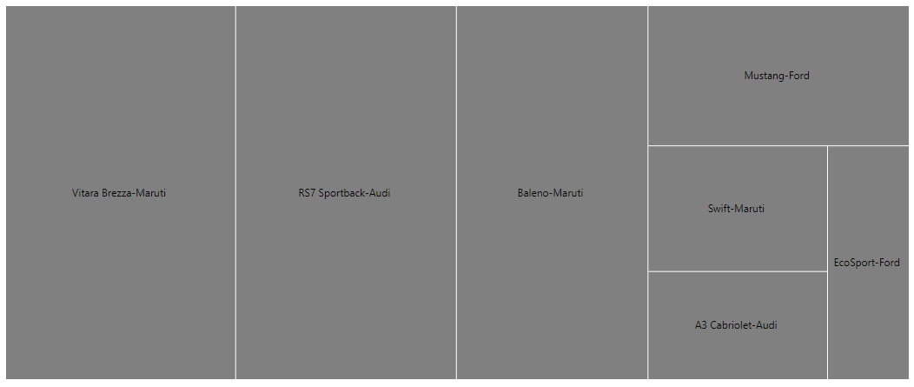
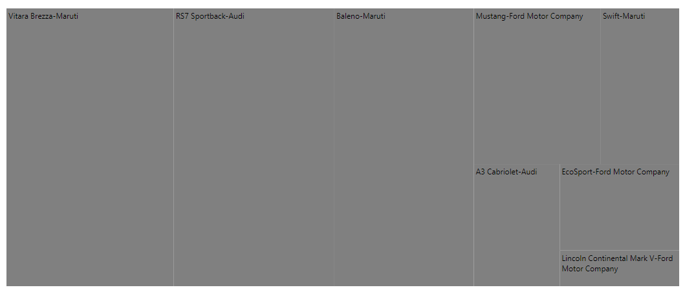

# Labels in Blazor TreeMap Component

Data Labels are used to identify the name of items or groups in the TreeMap component. Data Labels will be shown by specifying the data source properties in the [LabelPath](https://help.syncfusion.com/cr/blazor/Syncfusion.Blazor.TreeMap.TreeMapLeafItemSettings.html#Syncfusion_Blazor_TreeMap_TreeMapLeafItemSettings_LabelPath) of the [TreeMapLeafItemSettings](https://help.syncfusion.com/cr/blazor/Syncfusion.Blazor.TreeMap.TreeMapLeafItemSettings.html).

## Formatting labels

Customize the labels for each item using the [LabelFormat](https://help.syncfusion.com/cr/blazor/Syncfusion.Blazor.TreeMap.TreeMapLeafItemSettings.html#Syncfusion_Blazor_TreeMap_TreeMapLeafItemSettings_LabelFormat) property in the [TreeMapLeafItemSettings](https://help.syncfusion.com/cr/blazor/Syncfusion.Blazor.TreeMap.TreeMapLeafItemSettings.html).

```cshtml
@using Syncfusion.Blazor.TreeMap

<SfTreeMap WeightValuePath="Count" TValue="Car" DataSource="Cars" RangeColorValuePath="Count">
    <TreeMapLeafItemSettings LabelPath="Name" LabelFormat="${Name}-${Brand}"></TreeMapLeafItemSettings>
</SfTreeMap>

@code {
    public class Car
    {
        public string Name { get; set; }
        public string Brand { get; set; }
        public int Count { get; set; }
    };
    public List<Car> Cars = new List<Car> {
        new Car { Name="Mustang", Brand="Ford", Count=232 },
        new Car { Name="EcoSport", Brand="Ford", Count=121 },
        new Car { Name="Swift", Brand="Maruti", Count=143 },
        new Car { Name="Baleno", Brand="Maruti", Count=454 },
        new Car { Name="Vitara Brezza", Brand="Maruti", Count=545 },
        new Car { Name="A3 Cabriolet", Brand="Audi",Count=123 },
        new Car { Name="RS7 Sportback", Brand="Audi", Count=523 }
    };
}
```


## Label position

Customize the label position using the [LabelPosition](https://help.syncfusion.com/cr/blazor/Syncfusion.Blazor.TreeMap.TreeMapLeafItemSettings.html#Syncfusion_Blazor_TreeMap_TreeMapLeafItemSettings_LabelPosition) property by specifying any of the following locations.

* [BottomCenter](https://help.syncfusion.com/cr/blazor/Syncfusion.Blazor.TreeMap.LabelPosition.html#Syncfusion_Blazor_TreeMap_LabelPosition_BottomCenter)
* [BottomLeft](https://help.syncfusion.com/cr/blazor/Syncfusion.Blazor.TreeMap.LabelPosition.html#Syncfusion_Blazor_TreeMap_LabelPosition_BottomLeft)
* [BottomRight](https://help.syncfusion.com/cr/blazor/Syncfusion.Blazor.TreeMap.LabelPosition.html#Syncfusion_Blazor_TreeMap_LabelPosition_BottomRight)
* [Center](https://help.syncfusion.com/cr/blazor/Syncfusion.Blazor.TreeMap.LabelPosition.html#Syncfusion_Blazor_TreeMap_LabelPosition_Center)
* [CenterLeft](https://help.syncfusion.com/cr/blazor/Syncfusion.Blazor.TreeMap.LabelPosition.html#Syncfusion_Blazor_TreeMap_LabelPosition_CenterLeft)
* [CenterRight](https://help.syncfusion.com/cr/blazor/Syncfusion.Blazor.TreeMap.LabelPosition.html#Syncfusion_Blazor_TreeMap_LabelPosition_CenterRight)
* [TopCenter](https://help.syncfusion.com/cr/blazor/Syncfusion.Blazor.TreeMap.LabelPosition.html#Syncfusion_Blazor_TreeMap_LabelPosition_TopCenter)
* [TopLeft](https://help.syncfusion.com/cr/blazor/Syncfusion.Blazor.TreeMap.LabelPosition.html#Syncfusion_Blazor_TreeMap_LabelPosition_TopLeft)
* [TopRight](https://help.syncfusion.com/cr/blazor/Syncfusion.Blazor.TreeMap.LabelPosition.html#Syncfusion_Blazor_TreeMap_LabelPosition_TopRight)

```cshtml
@using Syncfusion.Blazor.TreeMap

<SfTreeMap WeightValuePath="Count" TValue="Car" DataSource="Cars" RangeColorValuePath="Count">
    <TreeMapLeafItemSettings LabelPath="Name" LabelFormat="${Name}-${Brand}" LabelPosition="LabelPosition.Center" Gap="2"></TreeMapLeafItemSettings>
</SfTreeMap>
```

> Refer to the [code block](#formatting-labels) to know about the property value of **Cars**.



## Intersect action

When the label size in each item exceeds the actual size, use the [InterSectAction](https://help.syncfusion.com/cr/blazor/Syncfusion.Blazor.TreeMap.TreeMapLeafItemSettings.html#Syncfusion_Blazor_TreeMap_TreeMapLeafItemSettings_InterSectAction) property in the [TreeMapLeafItemSettings](https://help.syncfusion.com/cr/blazor/Syncfusion.Blazor.TreeMap.TreeMapLeafItemSettings.html) to customise the labels.

```cshtml
@using Syncfusion.Blazor.TreeMap

<SfTreeMap WeightValuePath="Count" TValue="Car" DataSource="Cars">
    <TreeMapLeafItemSettings LabelPath="Name" LabelFormat="${Name}-${Brand}" InterSectAction="LabelAlignment.WrapByWord">
    </TreeMapLeafItemSettings>
</SfTreeMap>

@code{
    public class Car
    {
        public string Name { get; set; }
        public string Brand { get;set; }
        public int Count { get; set; }
    };
    public List<Car> Cars = new List<Car> {
        new Car { Name="Mustang", Brand="Ford Motor Company", Count=232 },
        new Car { Name="Lincoln Continental Mark V", Brand="Ford Motor Company", Count=50},
        new Car { Name="EcoSport", Brand="Ford Motor Company", Count=121 },
        new Car { Name="Swift", Brand="Maruti", Count=143 },
        new Car { Name="Baleno", Brand="Maruti", Count=454 },
        new Car { Name="Vitara Brezza", Brand="Maruti", Count=545 },
        new Car { Name="A3 Cabriolet", Brand="Audi",Count=123 },
        new Car { Name="RS7 Sportback", Brand="Audi", Count=523 }
    };
}
```


