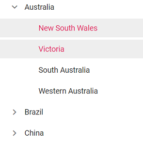

# MultiSelection in Blazor TreeView Component

Selection provides an interactive support and highlights the node that is selected. Selection can be done through simple mouse down or keyboard interaction. The TreeView also supports selection of multiple nodes by setting `AllowMultiSelection` to **true**. To multi-select, press and hold **CTRL** key and click the desired nodes. To select range of nodes, press and hold the **SHIFT** key and click the nodes.

In the following example, the `AllowMultiSelection` property is enabled.

> Multi selection is not applicable through touch interactions.

```cshtml
@using Syncfusion.Blazor.Navigations
<SfTreeView TValue="Country" AllowMultiSelection=true>
    <TreeViewFieldsSettings  TValue="Country" Id="Id" DataSource="@Countries" Text="Name" ParentID="ParentId" HasChildren="HasChild" Expanded="Expanded" Selected="IsSelected"></TreeViewFieldsSettings>
</SfTreeView>

@code{
    public class Country
    {
        public int Id { get; set; }
        public int? ParentId { get; set; }
        public string Name { get; set; }
        public bool HasChild { get; set; }
        public bool Expanded { get; set; }
        public bool IsSelected { get; set; }
    }
    List<Country> Countries = new List<Country>();

    protected override void OnInitialized()
    {
        base.OnInitialized();
        Countries.Add(new Country
        {
            Id = 1,
            Name = "Australia",
            HasChild = true,
            Expanded = true
        });
        Countries.Add(new Country
        {
            Id = 2,
            ParentId = 1,
            Name = "New South Wales",
            IsSelected = true
        });
        Countries.Add(new Country
        {
            Id = 3,
            ParentId = 1,
            Name = "Victoria",
            IsSelected = true
        });
        Countries.Add(new Country
        {
            Id = 4,
            ParentId = 1,
            Name = "South Australia"
        });
        Countries.Add(new Country
        {
            Id = 5,
            ParentId = 1,
            Name = "Western Australia"
        });
        Countries.Add(new Country
        {
            Id = 6,
            Name = "Brazil",
            HasChild = true
        });
        Countries.Add(new Country
        {
            Id = 7,
            ParentId = 6,
            Name = "Paraná"
        });
        Countries.Add(new Country
        {
            Id = 8,
            ParentId = 6,
            Name = "Ceará"
        });
        Countries.Add(new Country
        {
            Id = 9,
            Name = "China",
            HasChild = true
        });
        Countries.Add(new Country
        {
            Id = 10,
            ParentId = 9,
            Name = "Guangzhou"
        });
        Countries.Add(new Country
        {
            Id = 11,
            ParentId = 9,
            Name = "Shantou"
        });
    }
}

```



# SelectedNodes in Blazor TreeView Component

The `SelectedNodes` property is used to represent the nodes that are selected in the Blazor TreeView component. We can select the specific nodes by passing the array of nodes ID.

In the following example, the `SelectedNodes` are passed through the button click.

```cshtml
@using Syncfusion.Blazor.Navigations
<button @onclick="@TreeViewSelectedNodes">TreeView SelectedNodes</button>
<SfTreeView TValue="MusicAlbum" ShowCheckBox="true" AutoCheck="true" @bind-SelectedNodes="@SelectedNodes">
    <TreeViewFieldsSettings TValue="MusicAlbum" Id="Id" DataSource="@Albums" Text="Name" ParentID="ParentId" HasChildren="HasChild" Expanded="Expanded" IsChecked="IsChecked"></TreeViewFieldsSettings>
</SfTreeView>
@code{
    SfTreeView<MusicAlbum> treeview;
    public string[] SelectedNodes = Array.Empty<string>();
    public class MusicAlbum
    {
        public string Id { get; set; }
        public string ParentId { get; set; }
        public string Name { get; set; }
        public bool Expanded { get; set; }
        public bool? IsChecked { get; set; }
        public bool HasChild { get; set; }
    }
    List<MusicAlbum> Albums = new List<MusicAlbum>();
    protected override void OnInitialized()
    {
        base.OnInitialized();
        Albums.Add(new MusicAlbum
        {
            Id = "1",
            Name = "Discover Music",
            HasChild = true
        });
        Albums.Add(new MusicAlbum
        {
            Id = "2",
            ParentId = "1",
            Name = "Hot Singles"
        });
        Albums.Add(new MusicAlbum
        {
            Id = "3",
            ParentId = "1",
            Name = "Rising Artists"
        });
        Albums.Add(new MusicAlbum
        {
            Id = "4",
            ParentId = "1",
            Name = "Live Music"
        });
        Albums.Add(new MusicAlbum
        {
            Id = "04",
            HasChild = true,
            Name = "MP3 Albums"           
        });
        Albums.Add(new MusicAlbum
        {
            Id = "5",
            ParentId = "04",
            Name = "Rock",
            IsChecked = true
        });
        Albums.Add(new MusicAlbum
        {
            Id = "6",
            Name = "Gospel",
            ParentId = "04",
        });
        Albums.Add(new MusicAlbum
        {
            Id = "7",
            ParentId = "04",
            Name = "Latin Music"
        });
        Albums.Add(new MusicAlbum
        {
            Id = "8",
            ParentId = "04",
            Name = "Jazz"
        });
    }
    public void TreeViewSelectedNodes()
    {
        SelectedNodes = new string[] { "1","04" };
    }
}
```