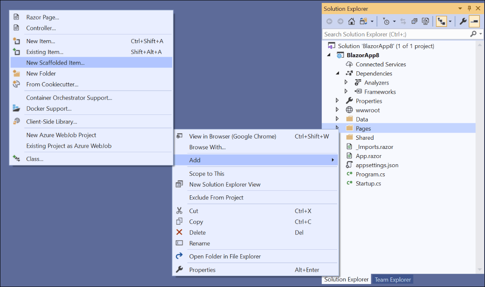
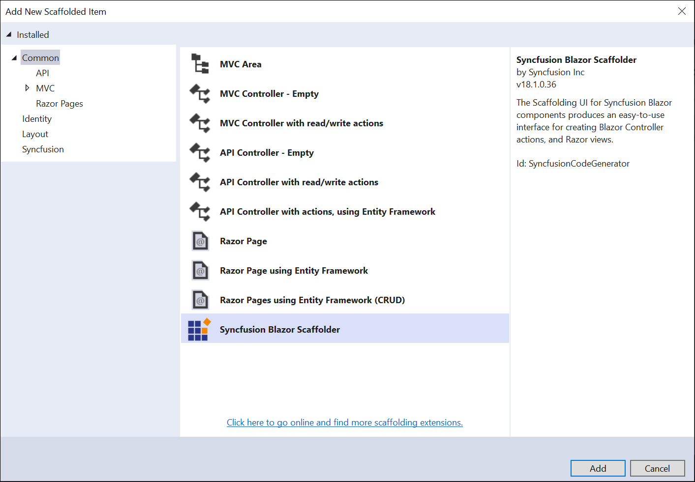
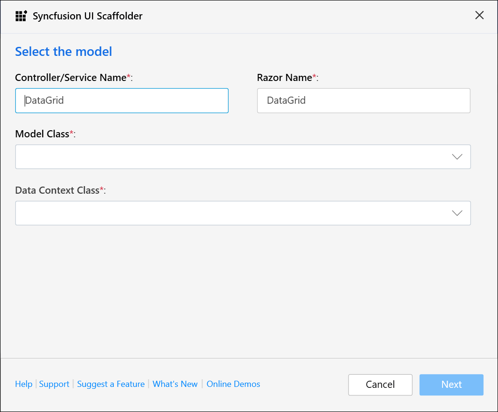
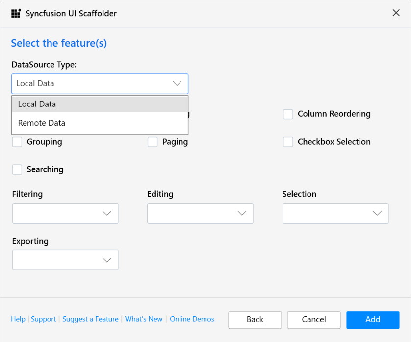
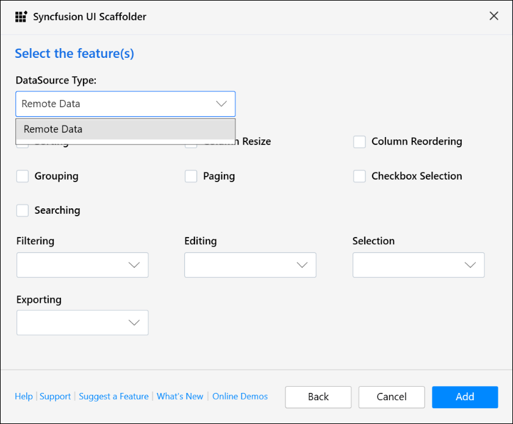
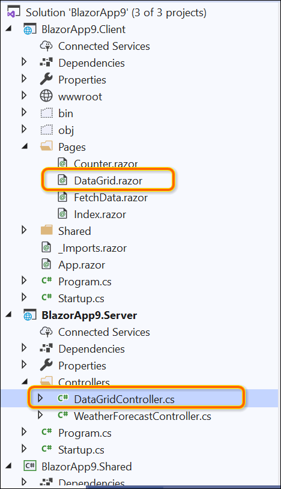
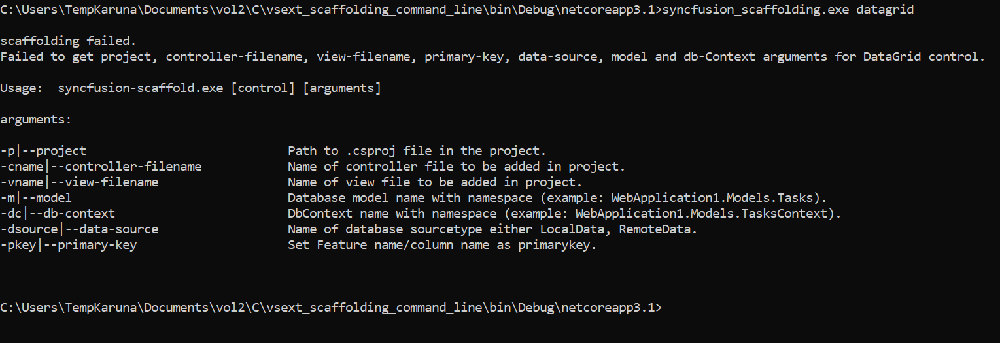

# Syncfusion Blazor Scaffolding

Syncfusion provides **Visual Studio Scaffolding** for the Syncfusion Blazor platform to quickly add code that interacts with data models and reduce the amount of time to develop with data operation in the project. Scaffolding provides an easier way to create Razor and Controller action methods for Syncfusion Blazor DataGrid, Charts, Scheduler, Diagram, Tree Grid, Rich Text Editor, Document Editor, and PDF Viewer controls.

> Check that at least one Entity Framework model exists, and the application has been compiled once. If no Entity Framework model exists in the application, refer to this [documentation](https://www.freecodecamp.org/news/how-to-create-an-application-using-blazor-and-entity-framework-core-1c1679d87c7e/) to generate the Entity Framework model. After the model file has been added, check that the required DBContext and properties are added. Now, build the application, and try scaffolding. If any changes are made in the model properties, rebuild the application once before performing scaffolding.

<!-- markdownlint-disable MD026 -->

> The Syncfusion Blazor Scaffolder is available from `v17.4.0.39` for Blazor server-side application and provided the Scaffolding support to Blazor client-side application from `v18.4.0.39`.

## Add a scaffolded item

The following steps explains how to add a scaffolded item to the Blazor application.

> Before using the Syncfusion Blazor Scaffolding, check whether the Syncfusion Blazor Template Studio Extension is installed or not in Visual Studio Extension Manager by clicking on the Extensions -> Manage Extensions -> Installed.

1. If the project type is **Blazor ServerSide**, right-click the **Pages** folder in the Solution Explorer, click **Add**, and then select **New Scaffolded Item..**

    

    If the project type is **Blazor Hosted**, right-click the **Controllers** folder from **{Project Name}.Server** project in the Solution Explorer, click **Add**, and then select **New Scaffolded Item**.

    

2. In the **Add Scaffold** dialog, select **Syncfusion Blazor Scaffolder** and then click **‘Add’**.

    

3. In the Syncfusion UI Scaffolder dialog, select the desired control to perform scaffolding, and then click **Next**.

    

    > Scheduler control is not applicable for Blazor Hosted application.

4. Syncfusion UI Scaffolder dialog will be opened for the selected control. Enter the **Controller/Service** Name and **Razor** Name as application requirements, and then select the required **Model Class** of the active project and its relevant **Data Context Class**, and then click **Next**.

    

5. Syncfusion UI Scaffolder for the selected control feature dialog will open. Select the required features, update the required data field, and then click **Add**.

    For **ServerSide Application**, both Local data and Remote data types will be available.

    

    For **Hosted Application**, Remote data type only available.

    

6. The **Controller/Service** file and the corresponding **Razor** files are generated with the selected features of the Syncfusion control code snippet.

    If you select **Local Data**, the service file and razor file will be added to the project.

    

    If you select **Remote Data**, the controller file and razor file will be added to the project.

    

7. Then, add navigation to the created razor file based on the requirement to open on the webpage.

8. After installing the trial setup or NuGet packages from nuget.org, register the Syncfusion license key to the project since Syncfusion introduced the licensing system from 2018 Volume 2 (v16.2.0.41) Essential Studio release. Navigate to the [help topic](https://help.syncfusion.com/common/essential-studio/licensing/license-key#how-to-generate-syncfusion-license-key) to generate and register the Syncfusion license key to the project. Refer to this [blog](https://blog.syncfusion.com/post/Whats-New-in-2018-Volume-2-Licensing-Changes-in-the-1620x-Version-of-Essential-Studio.aspx?_ga=2.11237684.1233358434.1587355730-230058891.1567654773) post for understanding the licensing changes introduced in Essential Studio.

## Syncfusion Blazor Command-line Scaffolding

Syncfusion provides **Scaffolding command-line** for Syncfusion Blazor to quickly add code that interacts with data models and reduce the amount of time to develop with data operation in the project. Scaffolding provides an easier way to create view file and Controller action methods for Syncfusion Blazor DataGrid, Charts, Scheduler, Diagram, Tree Grid, Rich Text Editor, Document Editor, and PDF Viewer controls.

> Check that at least one Entity Framework model exists. If no Entity Framework model exist in the application, refer to this [documentation](https://www.freecodecamp.org/news/how-to-create-an-application-using-blazor-and-entity-framework-core-1c1679d87c7e/) to generate the Entity Framework model. After the model file has been added, check that the required DBContext and properties are added. Now, build the application, and try scaffolding. If any changes are made in the model properties, rebuild the application once before performing scaffolding.

## Install Command-line Scaffolding

Install **syncfusion.scaffolding** tool globally by using the following command.

   ```dotnet tool install -g syncfusion.scaffolding```

## Update Command-line scaffolding

Update **syncfusion.scaffolding** tool globally by using the following command.

   ```dotnet tool update -g syncfusion.scaffolding```

## Add a scaffolded item from command-line

The following steps explains how to add a scaffolded item from command-line to the Blazor application.

> Before adding the scaffolded item from command-line, check whether the **dotnet-aspnet-codegenerator** tool is installed or not by **dotnet tool list -g** command in command prompt. If it is not installed, then install **dotnet-aspnet-codegenerator** tool globally by using this command **dotnet tool install -g dotnet-aspnet-codegenerator**.

1. After installed syncfusion.scaffolding tool, invoke the syncfusion_scaffold command which displays the available controls.

    **syncfusion_scaffold**

    

2. To add a scaffolded item from command-line invoke the syncfusion_scaffold application.

    **syncfusion_scaffold [control][arguments]**

    | Parameter                         | Description                                                                   | Control             |
    |-----------------------------------|-------------------------------------------------------------------------------|---------------------|
    | -p&#124;--project                 | Path to .csproj file in the project.                                          |  All Controls       |
    | -cname&#124;--controller-filename | Name of controller file to be added in project.                               | All controls        |
    | -vname&#124;--view-filename       | Name of view file to be added in project.                                     | All Controls        |
    | -m&#124;--model                   | Database model name with namespace (example: WebApplication1.Models.Tasks).   | All Controls        |
    | -dc&#124;--db-context             | DbContext name with namespace (example: WebApplication1.Models.TasksContext). | All Controls        |
    | -pkey&#124;--primary-key          | Set Feature name/column name as primary key.                                  | Data Grid/Tree Grid |
    | -tid&#124;--treegrid-id           | Id of Tasks.                                                                  | Tree Grid           |
    | -pid&#124;--parent-id             | Parent Id value                                                               | Tree Grid/Diagram   |
    | -x&#124;--x-axis                  | X-axis of Chart                                                               | Charts              |
    | -Y&#124;--Y-axis                  | Y-axis of Chart                                                               | Charts              |
    | -sid&#124;--scheduler-id          | Id of Scheduler Event.                                                        | Scheduler           |
    | -stime&#124;--start-time          | Start Time of Scheduler Event.                                                | Scheduler           |
    | -etime&#124;--end-time            | End Time of Scheduler Event.                                                  | Scheduler           |
    | --is-all-day                      | Set IsALLDay for Scheduler Event.                                             | Scheduler           |
    | -did&#124;--diagram-id            | Id of Diagram layout.                                                         | Diagram             |

3. If the syncfusion_scaffold [control] command is run, the parameters of control will be displayed.

    

4. Run the following command to generate controller and view files through command-line by passing required arguments of the given control.

    ```syncfusion_scaffold {controlName} --project "{projectFileNamewithPath}" --model {model} -dc {dbContext} -cname {controllerName} -vname {viewName} [controlMantoryParameter] [controlMantatoryParameterValue]```

    

5. The controller and view files are generated successfully and also the Syncfusion NuGet packages and styles are added which is required to render Syncfusion control.

   
   

<!-- markdownlint-disable MD026 -->

## How to render Syncfusion control?

Refer to the following UG links to render Syncfusion control after performing scaffolding:

WebAssembly App: [Configure Blazor components using Syncfusion.Blazor NuGet Package](https://blazor.syncfusion.com/documentation/getting-started/blazor-webassembly-visual-studio-2019/)

Blazor Server App: [Configure Blazor components using Syncfusion.Blazor NuGet Package](https://blazor.syncfusion.com/documentation/getting-started/blazor-server-side-visual-studio-2019/)