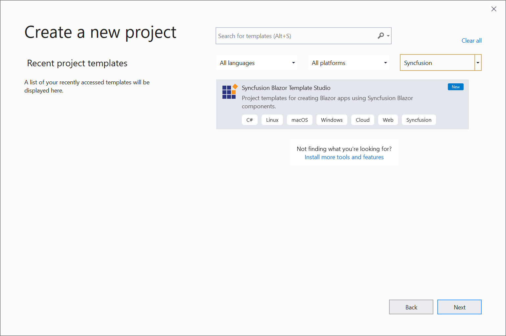
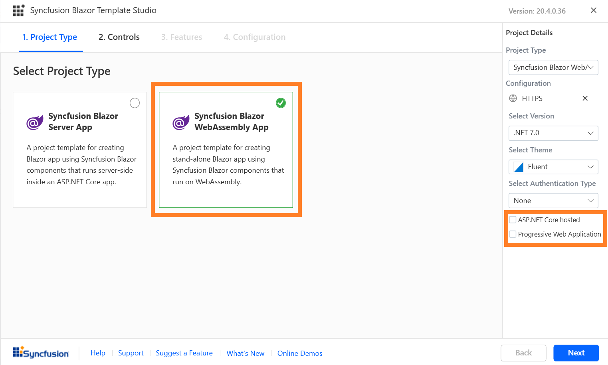
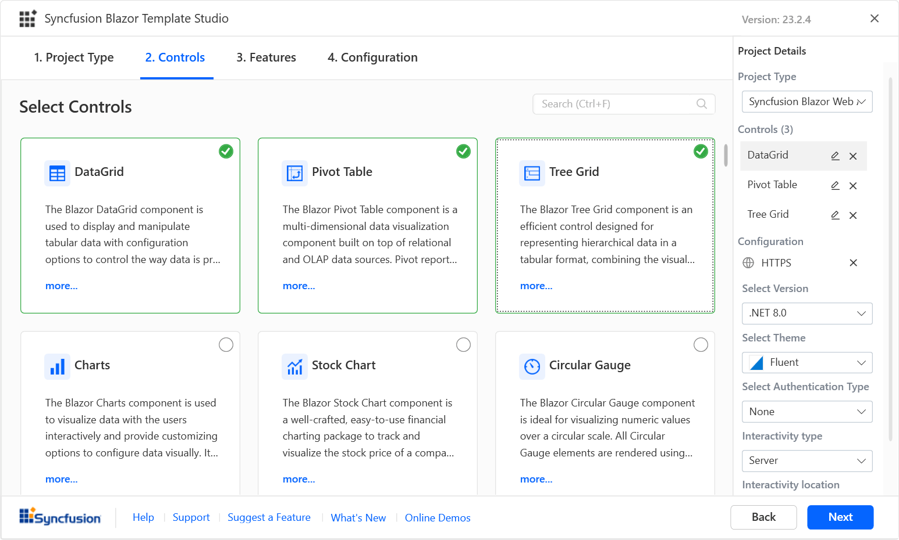
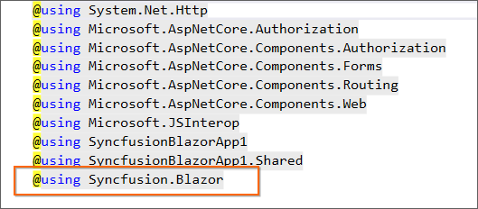
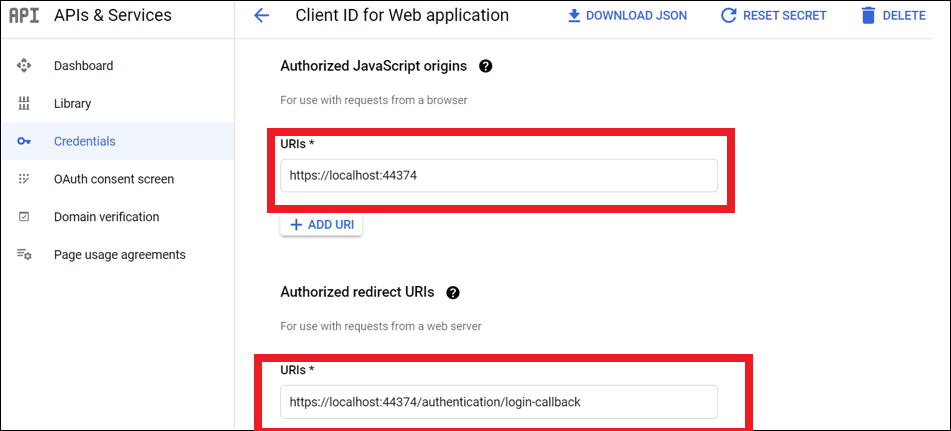
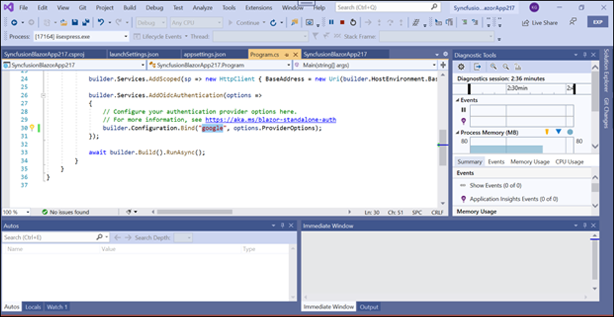
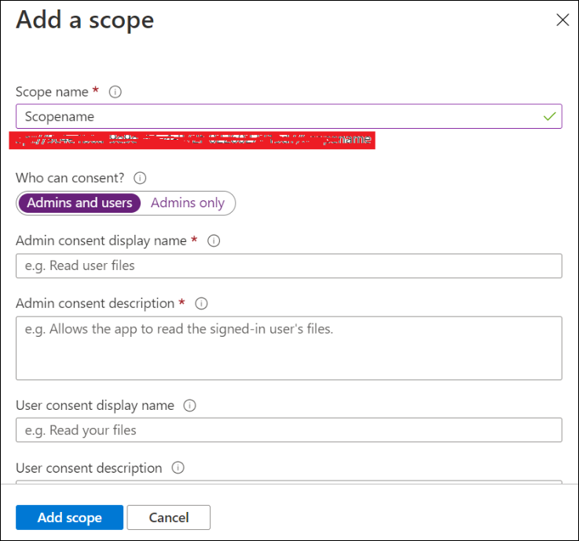
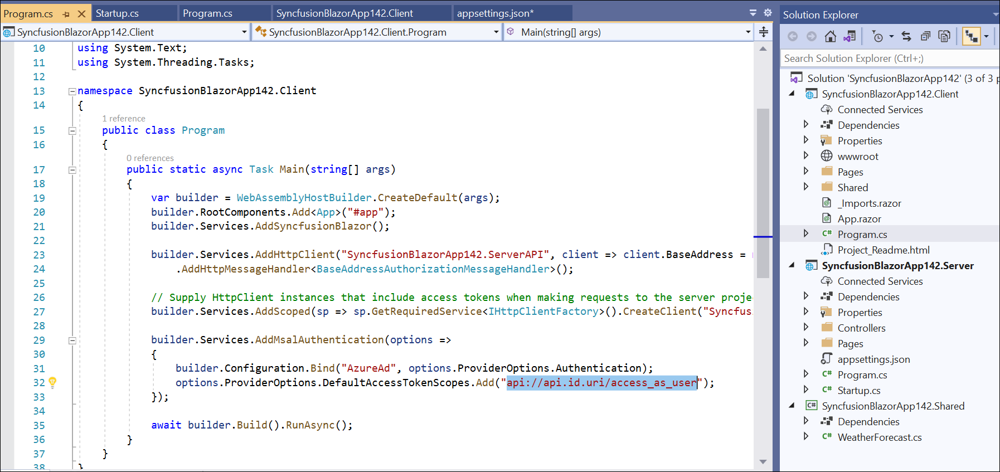
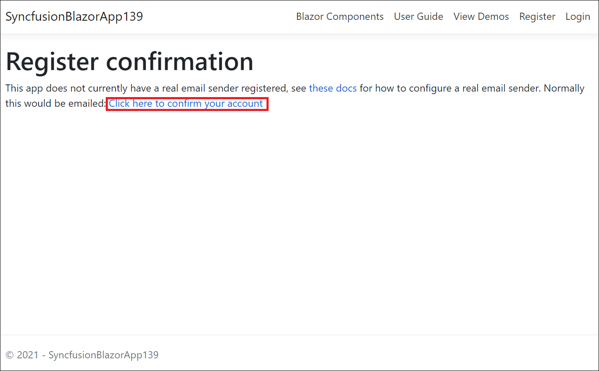
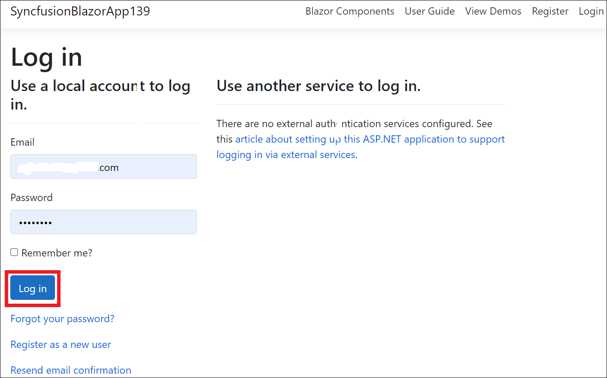

# Template Studio in Blazor

Syncfusion provides the Blazor Template Studio to create a Syncfusion Blazor application with Syncfusion components. The Syncfusion Blazor application is created with the required Syncfusion NuGet references, namespaces, styles, and component render code. The Template Studio provides an easy-to-use project wizard that teaches how to create an application with Syncfusion components.

The following steps will helps to create **Syncfusion Blazor Application** through **Visual Studio 2019**:

> Before using the Syncfusion Blazor Project Template, check whether the Syncfusion Blazor Template Studio Extension is installed or not in Visual Studio Extension Manager by clicking on the Extensions -> Manage Extensions -> Installed.

1. Open Visual Studio 2019.

2. To create a Syncfusion Blazor project, use either of the following options:

   **Option 1**

   Choose **Extension -> Syncfusion -> Essential Studio for Blazor -> Create New Syncfusion Project...** from the **Visual Studio menu**.

   

   **Option 2**

   Select **File -> New -> Project**. This opens a new dialog to create a new project. The templates provided by Syncfusion for Blazor can be obtained by filtering the project type for Syncfusion, or by using **Syncfusion** as the keyword in the search option.

   

3. Select the **Syncfusion Blazor Template Studio** and click **Next**.

   

4. The Template Studio wizard for configuring the Syncfusion Blazor app will appear. Select the Blazor type.

   

   **Project type section**

   Choose one of the Syncfusion Blazor project types:
   * Syncfusion Blazor Server App
   * Syncfusion Blazor WebAssembly App

   In the Syncfusion Blazor WebAssembly App project type, choose **ASP.NET Core hosted**, **Progressive Web Application** or both.

   

   > The Progressive Web Application will be enabled if .NET Core version 3.1.200 or higher is installed.

5. Click either **Next** or the **Controls** tab. The Syncfusion Blazor components that can be added to the application are listed.

   

   Choose the required controls by clicking **Add**.

   

   To unselect the added control, use either of the following options:

   **Option 1:** Click **Remove** in the corresponding control box.

   **Option 2:** Click Delete in the control list from **Project Details**.

   

   > Choose at least one control to enable the Features and Configuration tab.

6. Click either **Next** or the **Features** tab, and see the features listed for the selected controls. The required features can be chosen.

7. Click either **Next** or the **Configuration** tab, and the Configuration section will be loaded. Choose the required (.NET 5.0 and ASP NET Core 3.1), themes, https configuration, authentication type (None, Individual Accounts, Microsoft Identity Platform, and Windows), and Blazor Web Assembly project types (ASP.NET Core hosted and Progressive Web Application).

   > ASP.NET Core hosted and Progressive Web Application options are only visible for the Blazor Web Assembly App project type.

   

   **Project details section**

   The configuration details below in the Project Details section can be changed to change the project type, delete controls, or change the configurations.

   

8. Click **Create**. The Syncfusion Blazor application has been created.

    

9. If the trial setup or NuGet packages are installed from nuget.org, register the Syncfusion license key to the project since Syncfusion introduced the licensing system from 2018 Volume 2 (v16.2.0.41) Essential Studio release. Navigate to the [help topic](https://help.syncfusion.com/common/essential-studio/licensing/license-key#how-to-generate-syncfusion-license-key) to generate and register the Syncfusion license key to the project. Refer to this [blog](https://blog.syncfusion.com/post/Whats-New-in-2018-Volume-2-Licensing-Changes-in-the-1620x-Version-of-Essential-Studio.aspx?_ga=2.11237684.1233358434.1587355730-230058891.1567654773) post for understanding the licensing changes introduced in Essential Studio.

## Syncfusion integration

The latest Syncfusion Blazor NuGet packages, styles, namespaces, and component render code for Syncfusion components are added in the created application.

### NuGet Packages

The following NuGet packages can be added as NuGet references based on application type.

| Syncfusion Blazor NuGet packages  | Application type  |
|---|---|
| `Syncfusion.Blazor`  | Syncfusion Blazor Server App   Syncfusion Blazor WebAssembly App   Syncfusion Blazor WebAssembly App (ASPNET Core hosted)   Syncfusion Blazor WebAssembly App (Progressive Web Application)   Syncfusion Blazor WebAssembly App (ASPNET Core hosted and Progressive Web Application)|
| `Syncfusion.Blazor.PdfViewerServer.Windows`  | Syncfusion Blazor Server App  |
| `Syncfusion.Blazor.WordProcessor`  | Syncfusion Blazor Server App   Syncfusion Blazor WebAssembly App   Syncfusion Blazor WebAssembly App (ASPNET Core hosted)   Syncfusion Blazor WebAssembly App (Progressive Web Application)   Syncfusion Blazor WebAssembly App (ASPNET Core hosted and Progressive Web Application)|

> The installed Syncfusion extension version of a NuGet package will be added as reference entry if there is no internet connection. Restore the NuGet packages when internet becomes available.

### Style

The selected theme is added from Syncfusion NuGet and its reference at these applications' locations in Blazor.

| Application type  | File location  |
|---|---|
| Syncfusion Blazor Server App | {Project location}\Pages\\_Host.cshtml |
| Syncfusion Blazor WebAssembly App (ASPNET Core hosted)   Syncfusion Blazor WebAssembly App (ASPNET Core hosted and Progressive Web Application) | {Client Project location}\wwwroot\index.html  |
| Syncfusion Blazor WebAssembly App   Syncfusion Blazor WebAssembly App (Progressive Web Application) | {Project location}\wwwroot\index.html|

### Namespaces

The Syncfusion.Blazor namespaces are added in the **`_imports.razor`** file.

### Component render code

The selected Syncfusion Blazor components and features render code added as .razor files in the pages folder.

### Authentication Configuration

The created application has to be registered in Google Platform API Console for Individual Accounts and Azure Active Directory for Microsoft Identity Platform. From Google Platform API Console registration, get the client id for Individual Accounts. From Azure Active Directory registrations, get the tenant id and project client id for Microsoft Identity Platform. These id values must be configured in created applications then only the project will run correctly with authentication support.

### Individual Accounts Authentication

#### Web Application and Progressive Web Application

1. Go to below credentials page for the Google cloud platform API console.

    <https://console.cloud.google.com/apis/credentials?project=aerobic-furnace-244104>

2. Click Create Credentials and o-auth Client Id.

    

    

3. Select Application type as Web Application in client Id creation.

    

4. Add the published URL link as an Authorized URI and login URL as Redirected URI.

    

5. Click save, then o-auth client id will be created and copy that credentials.

    

6. Add that Client Id, and RedirectUri in appsettings.json file of the project.

    

7. Change the build configuration bind as google from Local in program.cs file.

    

### Microsoft Identity Platform Authentication

#### Server Application

1. Go to below Azure Active Directory App Registration page.

    <https://portal.azure.com/#blade/Microsoft_AAD_IAM/ActiveDirectoryMenuBlade/RegisteredApps>

2. Click New Registration in App Registration page.

    

3. Give name of the application and selected supported type as single tenant.

    

4. Dropdown the page, select platform as web and give the application Redirect URI and click Register.

    

5. App will be registered, go to the Authentication page and tick Id token check box.

    

6. Get client tenant id and application id form overview page.

    

7. Configure those client tenant id, application id, and domain in the project appsettings.json file.

    

#### Web Application and Progressive Web Application

1. Go to below Azure Active Directory App Registration page.

    <https://portal.azure.com/#blade/Microsoft_AAD_IAM/ActiveDirectoryMenuBlade/RegisteredApps>

2. Click New Registration in App Registration page.

    

3. Give name of the application and selected supported type as single tenant.

    

4. Dropdown the page, select platform as web and give the application Redirect URI and click Register.

    

5. App will be registered, go to the Authentication page and tick Access token an Id token check box.

    

6. Migrate the API by clicking the highlighted arrow.

    

    

7. Get client tenant id and application id form overview page.

    

8. Configure those client tenant id and application id in the project appsettings.json file.

    

#### ASP.NET Core Hosted Web Application, and ASP.NET Core Hosted with Progressive Web Application

##### Client project Registration and Configuration

1. Go to below Azure Active Directory App Registration page.

    <https://portal.azure.com/#blade/Microsoft_AAD_IAM/ActiveDirectoryMenuBlade/RegisteredApps>

2. Click New Registration in App Registration page.

    

3. Give name of the application and selected supported type as single tenant.

    

4. Dropdown the page, select platform as web and give the application Redirect URI and click Register.

    

5. App will be registered, go to the Authentication page and tick Access token an Id token check box.

    

6. Migrate the API by clicking the highlighted arrow.

    

    

7. Get client tenant id and application id form overview page.

    

8. Configure those client tenant id and application id in the project appsettings.json file.

    

##### Server project Registration and configuration

1. Go to Azure Active Directory App Registration page.

    <https://portal.azure.com/#blade/Microsoft_AAD_IAM/ActiveDirectoryMenuBlade/RegisteredApps>

2. Click New Registration in App Registration page.

    

3. Give name of the application and selected supported type as single tenant.

    

4. Dropdown the page, select platform as web and give the application Redirect URI and click Register.

    

5. App will be registered, go to the Authentication page and tick Access token an Id token check box.

    

6. Migrate the API by clicking the highlighted arrow.

    

    

7. Add a scope API in Expose an API page.

    

8. Give scope name, admin consent display name, and admin consent description and click Add scope. Scope API will be created, copy those scope API Value.

    

9. Get client tenant id and application id form overview page.

    

10. Configure those client tenant id, application id, and domain in the project appsettings.json file.

    

11. Configure the scope API in client project program.cs file.

    

### Run application

Run the application and see the Syncfusion components that are selected. Select a component to see component output.

Select a culture language in combobox at top right on the page to apply the culture in the application.

### Register and Login Application

### Individual Authentication

#### Server Application, ASP.NET Core hosted Web Application, and Progressive Web Application with ASP.NET Core hosted

1. To register the application, submit your email address and create a password.

    

2. Confirm registration by clicking **Click here to confirm your account.**

    

3. Submit your registered email address and password to login the application.

    

#### Web Application and Progressive Web Application

1. Login to the application using Gmail accounts.

    

### Microsoft Identity Platform

#### Server Application, Web Application, Progressive Application, ASP.NET Core Hosted Web Application, and ASP.NET Core Hosted with Progressive Web Application

1. Login to your application using your Microsoft account.

2. Accept permission request of your Application.

    

> Above combobox will be enabled in sample output only if localization option is selected in configuration window from Blazor Template Studio wizard.
