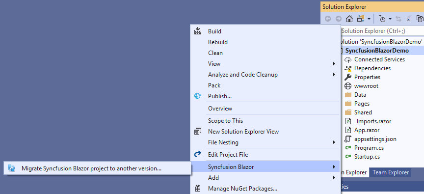

# Upgrading Syncfusion Blazor application to latest version

The Syncfusion Blazor migration add-in for Visual Studio allows you to migrate an existing Syncfusion Blazor application from one version of Essential Studio version to another version. This reduces the amount of manual work required when migrating the Syncfusion version.

The steps below will assist you to upgrade the Syncfusion version in the Syncfusion Blazor application via Visual Studio 2019:

> Before using the Syncfusion Blazor Project Migration, check whether the Syncfusion Blazor Template Studio Extension installed or not in Visual Studio Extension Manager by clicking on the Extensions -> Manage Extensions -> Installed.

1. Open the Syncfusion Blazor application that uses the Syncfusion component.

2. To open the Migration Wizard, either one of the following options should be followed:

    **Option 1**

    Choose **Extensions -> Syncfusion -> Essential Studio for Blazor -> Migrate Project…** from Visual Studio 2019 menu.

    

    **Option 2**

    Right-click the application from the **Solution Explorer** and select the **Syncfusion Blazor** and choose the **Migrate Syncfusion Blazor project from another version...**

    

3. The Syncfusion Project Migration window will appear. You can choose the required version of Syncfusion Blazor to migrate.

    > The versions are loaded from the Syncfusion Blazor NuGet packages published in [`NuGet.org`](https://www.nuget.org/packages?q=Tags%3A%22blazor%22syncfusion) and it requires internet connectivity.

    

4. Check the **“Enable a backup before migrating”** checkbox if you want to take the project backup and choose the location.

5. Once the migration process is completed, you will get a successful message window.

    

    If you enabled project backup before migrating, the old project will be saved in the specified backup path location as shown below once the migration process is completed.

    

6. The Syncfusion Blazor NuGet packages are updated to the respective version in the application.

7. If you installed the trial setup or NuGet packages from nuget.org you must register the Syncfusion license key to your project since Syncfusion introduced the licensing system from 2018 Volume 2 (v16.2.0.41) Essential Studio release. Navigate to the [help topic](https://help.syncfusion.com/common/essential-studio/licensing/license-key#how-to-generate-syncfusion-license-key) to generate and register the Syncfusion license key to your project. Refer to this [blog](https://blog.syncfusion.com/post/Whats-New-in-2018-Volume-2-Licensing-Changes-in-the-1620x-Version-of-Essential-Studio.aspx?_ga=2.11237684.1233358434.1587355730-230058891.1567654773) post for understanding the licensing changes introduced in Essential Studio.

## NuGet Packages

The installed Syncfusion Blazor NuGet packages are updated to the selected version of Syncfusion Blazor.

## Theme link

The Syncfusion theme links in the `~/Pages/Host.cshtml` or `~/wwwroot/index.html` file have been updated.

